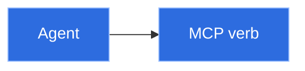
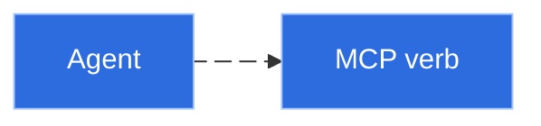

---
paths:
  - "**/*.md"
---

# Mermaid Diagram Conventions

Applies when a Markdown doc (`DESIGN.md`, ADRs, `docs/design/`, READMEs, handoffs) includes a
Mermaid diagram. The "diagram by default" trigger itself lives in root `CLAUDE.md`.

## Theme-neutral colors (must stay legible on dark *and* light backgrounds)

- Never rely on the default Mermaid theme.
- Give nodes explicit mid-tone fills with a contrasting stroke and label color via `classDef`,
  applied with a **separate `class A,B name` statement** — not inline `:::` when an edge-id is also
  on the line (that combination is parse-fragile).
- Keep edge strokes a mid-tone (e.g. `#8892b0`) that reads on both.
- Avoid near-white / near-black fills and unstyled text sitting directly on the page background.

## Animated connections — only where supported, never load-bearing

- Mermaid edge animation (edge-id `e1@-->` + `e1@{ animate: true }`) needs Mermaid **≥ v11.5**; it
  renders on mermaid.live, Mermaid Chart, and recent VS Code previews.
- GitHub's support is unconfirmed (June 2026), so **default GitHub-rendered docs (ADRs, READMEs,
  `docs/`) to static** — an unsupported `e1@-->` is a *parse error that kills the whole diagram*,
  not a graceful fallback to a static arrow.
- Animate only where it renders, and ensure the diagram still reads with animation dropped.

## Canonical skeleton — static, GitHub-safe (parses anywhere)

## Animated variant — only on surfaces with Mermaid ≥ v11.5 edge animation (not GitHub today)

