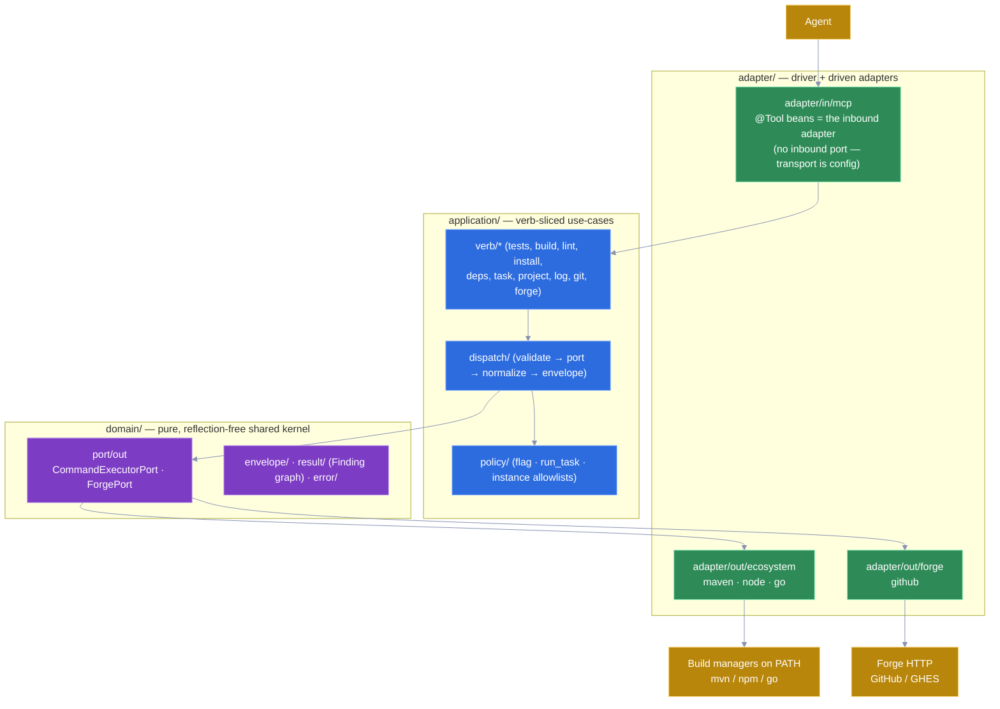
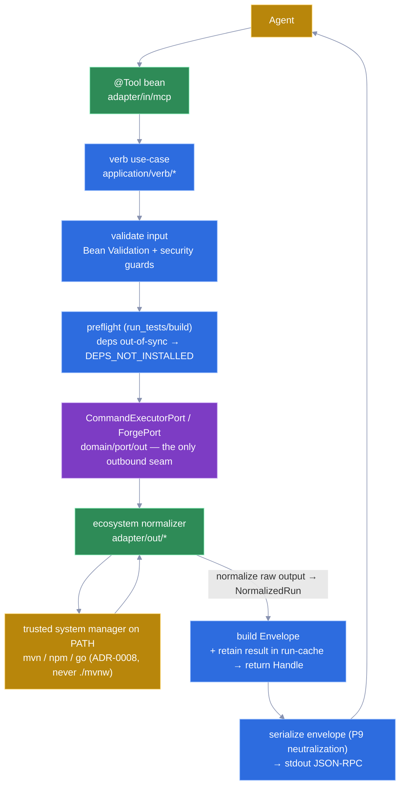
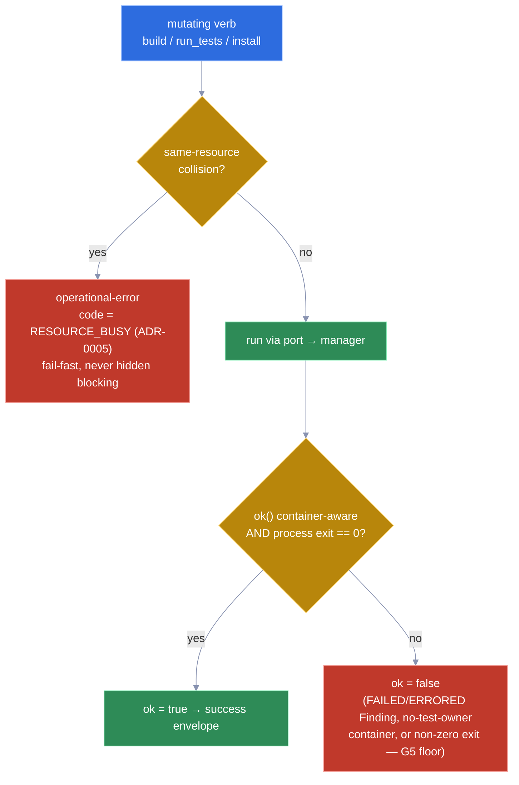
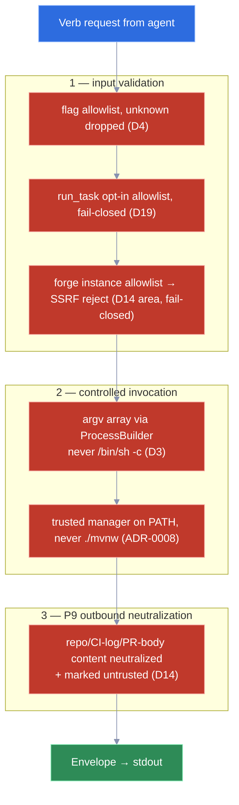

# DESIGN — no-bash-mcp architecture

> **Status:** the *before-coding* architecture document. It is written **from** the `/prototype`
> output (see [`prototype/NOTES.md`](./prototype/NOTES.md)) and **promotes**
> [ADR-0006](./docs/adr/0006-application-architecture.md) from *proposed* → **accepted**. It is the
> single source of truth for **how the system is structured in code**; the *what & why* of product
> decisions live in [`docs/design/`](./docs/design/), the empirical grounding in
> [`docs/research/`](./docs/research/), and the ubiquitous language in [`CONTEXT.md`](./CONTEXT.md).
> This document is the **canonical copy** of the code structure and mechanics (per `CLAUDE.md`'s source-
> of-truth split); it **references** the corpus for rationale and empirical grounding rather than
> re-deriving them.
>
> **Scope of "decided" here.** The macro-architecture, the universal test-result schema (validated by
> the prototype against three real reports), the package structure, the output contract, the build/
> native posture, and the testing posture. **Field-level names** of the normalized schema are now
> **frozen in [ADR-0007](./docs/adr/0007-normalized-test-result-schema.md)** (accepted) by the
> universal-schema spike — the §2 record graph below is the freeze of record.

---

## 1. Architecture: lightweight Hexagonal + per-verb feature slices, single module

Chosen **from a survey** of real JVM MCP servers and current Java application architectures
([`docs/research/architecture-survey.md`](./docs/research/architecture-survey.md)), not invented. The
decision and its rejected alternatives are recorded in
[ADR-0006](./docs/adr/0006-application-architecture.md).

- **Macro-architecture = Hexagonal / Ports-and-Adapters (lightweight).** The deciding variable is
  **adapter count, not project size**: two distinct outbound technologies (process execution + forge
  HTTP) each need an independent test seam. Every surveyed Micronaut MCP server converges on *thin
  annotated tool beans delegating to services/adapters, with transport selected by configuration* —
  hexagonal in effect.
- **Inbound driver adapter = Micronaut MCP `@Tool` methods on `@Singleton` beans.** There is **no
  inbound port interface** — the `@Tool` bean *is* the adapter; transport is **configuration**
  (`micronaut.mcp.server.transport=STDIO`), not code.
- **Two outbound driven ports**, plain Java interfaces in the pure domain:
  - `CommandExecutorPort` — ecosystem/process execution.
  - `ForgePort` — read-only forge inspection over HTTP.
- **Inside the application: feature-organized by verb** (vertical-slice flavor) over a **bounded
  shared kernel** (`domain/` pure types + `infra/` shared infrastructure). No separate `common/`.
- **Single Maven module**, with the dependency rule enforced by an **ArchUnit** test (KISS at ~15
  verbs; revisit a multi-module split only if the core outgrows an ArchUnit rule).
- **Domain types are reflection-free**: Java records annotated `@Serdeable @Introspected` (+
  `@JsonSchema` on tool I/O), GraalVM-native-ready.



*Hexagonal layering: the only two outbound ports (`CommandExecutorPort`, `ForgePort`) sit on the pure-domain boundary; the `@Tool` bean is itself the inbound adapter (no inbound port), and there are exactly two driven adapters — no `out/harness/` in the server module (§8).*

Rejected (with evidence in the survey): classic layered (no seam → forge untestable), Onion/Clean
(no entities/orchestration → ~3× class count for pass-through verbs), pure vertical-slice (shared
kernel > per-verb code → use the hybrid), full-ceremony hexagonal (use-case interface per verb is
ceremony for 1:1 mappings), bare MCP SDK (boilerplate), Spring AI MCP (pre-GA, reflection posture).

---

## 2. The universal test-result schema (the spine — validated by the prototype)

Normalizing dissimilar test frameworks into **one** schema is the project's riskiest bet. The
`/prototype` pass folded **three real, dissimilar reports** — Surefire JUnit-XML, `jest --json`
(29.7.0), `go test -json` (Go 1.26) — into one record graph, with **no signal loss** and **no false
precision**. Full evidence and the divergence-by-divergence reconciliation:
[`prototype/NOTES.md`](./prototype/NOTES.md); the axes:
[`docs/design/schema-divergence-map.md`](./docs/design/schema-divergence-map.md).

**Validated shape** (lives in `domain/result/`; field names finalized post-spike):

```java
enum Outcome { PASSED, FAILED, ERRORED, SKIPPED }          // normalized; raw status kept per finding

record SourceRef(String file, Integer line) {}             // best-effort, derived, nullable (line BOXED)

sealed interface Finding permits TestFinding, ContainerFinding {
    Outcome outcome(); String rawStatus(); String message(); SourceRef source(); String detail();
}
record TestFinding(String suite, String name, List<String> path,                 // flexible identity path
                   Outcome outcome, String rawStatus, String message, SourceRef source, String detail)
        implements Finding {}
enum ContainerScope { SUITE, FILE, PACKAGE, RUN }
record ContainerFinding(ContainerScope scope, String container,                  // a failure with no test owner
                        Outcome outcome, String rawStatus, String message, SourceRef source, String detail)
        implements Finding {}

record Summary(int total, int passed, int failed, int errored, int skipped) {}   // TEST counts only
record NormalizedRun(String tool, Summary summary, List<Finding> findings) {
    boolean ok() { … }   // container-aware: derived from FINDINGS, not from counts (see counting rule)
}
```

The five invariants it encodes (all confirmed empirically):

| # | Invariant | Encoding |
|---|---|---|
| 1 | Identity is a flexible path | `TestFinding{suite, name, path[]}` — never a fixed `classname` |
| 2 | `file:line` + diff best-effort / nullable | `SourceRef` nullable, `Integer line` boxed; `message` nullable |
| 3 | **First-class failure with no test owner** | `ContainerFinding` — a sealed sibling carrying **no** test name |
| 4 | Outcome enum + raw status retained | `Outcome` + `rawStatus` |
| 5 | Expected-vs-actual not reliably structurable | `message` + raw `detail`; no structured expected/actual |

**The load-bearing finding:** the no-test-owner failure (axis 5) surfaces in **three distinct scopes,
one type** — `[SUITE]` (JUnit `@BeforeAll` throw → `<testcase name="">`), `[FILE]` (jest collection/
module-load failure → empty `assertionResults` + file `message`), `[PACKAGE]` (Go `init()` panic →
package `fail` with no `Test`). It is modeled as a `ContainerFinding`, **never** as a degenerate test
with an empty name. This is the discriminator the schema bet rode on, and it held in all three.

> **Real-report correction:** producing the real jest report disproved `schema-divergence-map.md`'s
> axis-5 claim that a `beforeAll` throw makes assertions "vanish." In jest 29.7 the hook failure is
> attributed **per test**; the genuine no-owner case is a **collection/module-load** failure. The
> divergence map is corrected accordingly; the schema handles both shapes. This is exactly the class
> of error the "real reports, never reconstruct from memory" discipline exists to catch.

**Counting rule (a prototype-surfaced trap).** A `ContainerFinding` is **not** a test, so `Summary`
holds **test-level counts only** and `ok` is derived from **findings**:
`ok = no Finding is FAILED or ERRORED`. Deriving `ok` from `failed == 0 && errored == 0` would
**false-green** a run whose *only* failure is a no-test-owner container (all tests passed by count) —
exactly the G5 lossy-summary failure mode the project exists to prevent. The prototype's three fixtures
masked this (each also carried ordinary failing tests); a synthetic container-only run now guards it,
and all three normalizers count containers identically (into `findings`, never the test counts). An
implementer copying `ok()` semantics must keep it container-aware (and, in production, also treat a
non-zero process exit as a failure signal).

### serde 3.0.0 constraints baked into the schema (implementable-by-construction)

`micronaut-platform:5.0.2` manages **micronaut-serialization 3.0.0**. `Finding`/`NormalizedRun` are
primarily **server output** (serialized *to* the agent); the serde **deserialization** defaults below
bite only if/when these types are read back (e.g. a run-cache disk spill). The schema is designed to
satisfy them regardless, so it is implementable-by-construction (detail:
[`docs/research/testing-stack-research.md`](./docs/research/testing-stack-research.md) §8):

> **Validation scope (spike s2 caveat).** These serde constraints are validated **on the JVM** (spike
> `s1` folds the real `Finding` records). The **native** serialization of the *polymorphic* graph —
> `@JsonTypeInfo`/`defaultImpl` discrimination + boxed-null emission for `sealed Finding` — was **not**
> exercised under native-image (s2's native binary serialized only a flat `PingResult`). A `/tdd`+CI
> native round-trip of a `List<Finding> = [TestFinding, ContainerFinding]` (serialize **and**
> deserialize, since `defaultImpl`/`fail-on-null` bite on read-back) is owed before the native release.

- **Polymorphism:** `sealed Finding` → `@JsonTypeInfo(use = NAME, property = "kind", defaultImpl = …)`.
  On output it gives the agent a stable shape to branch on (not a null `name`); `defaultImpl` keeps it
  forward-compatible when a finding kind is added, and satisfies `subtypes-require-default-impl`
  (default `true`) on any read-back.
- **Optional wire fields are boxed:** `Integer line`, never `int` — emits `null` rather than a
  misleading `0` on output, and satisfies `fail-on-null-for-primitives` (default `true`) on read-back.

---

## 3. Package structure (single Maven module; tests mirror src)

Base package `dev.nobash` (proposed groupId `dev.nobash`, artifactId `no-bash-mcp` — a settable
detail). Confirmed against the survey (§3.1) and the prototype.

```
src/main/java/dev/nobash/
  Application.java                  # Micronaut.build(args).banner(false).start()

  domain/                          # PURE — reflection-free records + interfaces only
    envelope/                      # Envelope, Handle
    result/                        # Finding (sealed) → TestFinding | ContainerFinding, SourceRef,
                                   #   Outcome, ContainerScope, Summary, NormalizedRun  ← the §2 schema
    error/                         # OperationalError + codes (NO_MANAGER_DETECTED, RESOURCE_BUSY, …)
    port/out/                      # CommandExecutorPort, ForgePort   ← plain interfaces, 0 annotations

  application/                     # @Singleton use-cases; constructor injection; verb-sliced
    verb/
      tests/ build/ lint/ install/ deps/ task/ project/ log/ git/ forge/   # one slice per verb-group
    policy/                        # flag allowlist, run_task allowlist, instance allowlist
    dispatch/                      # shared orchestration: validate → port → normalize → envelope

  adapter/
    in/mcp/                        # @Singleton @Tool beans (BuildTools, ProjectTools, GitTools,
                                   #   ForgeTools); request→verb mapping, envelope serialization,
                                   #   untrusted-content neutralization (P9)
    out/ecosystem/{maven,node,go}/ # ProcessBuilder invocation + reporter injection + report parsing
                                   #   → implements CommandExecutorPort; holds ALL format knowledge
    out/forge/{github}/            # HTTP REST/GraphQL client + normalization → implements ForgePort
    # NOTE: there is no out/harness/ in the server module. The harness permission-
    #   config writer implements NEITHER port; it ships in the SEPARATE bootstrap-
    #   skill deliverable (§8, bootstrap-and-deployment.md). The running server has
    #   exactly two outbound adapters (ecosystem, forge).

  infra/                           # process exec (tree-kill + timeout), HTTP client factory
                                   #   (CA/proxy/auth), run-cache, secret resolution,
                                   #   concurrency / RESOURCE_BUSY guard
  config/                          # @ConfigurationProperties records (non-sensitive knobs only)

src/main/resources/
  application.yml                  # transport=STDIO ; banner.enabled=false
  logback.xml                      # ConsoleAppender → System.err  (stdout is JSON-RPC only)
  META-INF/native-image/dev.nobash/no-bash-mcp/   # reachability metadata (mostly auto-generated)

src/test/java/dev/nobash/          # MIRRORS src/main (tests-mirror-src)
src/test/resources/fixtures/{maven,jest,go,forge}/   # golden reports + HTTP responses
src/test/resources/security/       # bad-flags.csv, SSRF hosts, injection payloads
```

The **shared kernel** is `domain/` + `infra/`; the two ports live in `domain/port/out`; there is
deliberately no inbound port interface.

---

## 4. Component model & dispatch flow

Inbound `@Tool` beans grouped **per verb-family** (recommendation: ≈4–6 beans — `BuildTools`,
`ProjectTools`, `GitTools`, `ForgeTools`), matching the real-world capability-grouping pattern and
keeping the inbound surface small. Each `@Tool` method delegates to an `application/verb/*` use-case,
which calls a `domain/port/out` interface, satisfied at startup by an `adapter/out/*` bean via
Micronaut compile-time DI. The full v1 verb set (tool-catalog.md) maps to these beans:
`BuildTools` (`run_tests`, `build`, `install`, `lint`, `run_task`), `ProjectTools`
(`describe_project`, `dependencies`, `get_log`), `GitTools` (the five read-only `git_*`),
`ForgeTools` (`pr_checks`, `pr_view`, `pr_diff`).

```
agent → @Tool bean (adapter/in/mcp)
      → verb use-case (application/verb/*)
          → validate input (Bean Validation + programmatic security guards)
          → preflight (run_tests/build): deps missing/out-of-sync vs lockfile → DEPS_NOT_INSTALLED
                                          (hint "run install") BEFORE exec — never a cryptic trace
          → CommandExecutorPort / ForgePort   (domain/port/out)   ← the only outbound seam
          → normalize raw output → NormalizedRun (adapter/out/* normalizer)
          → build Envelope (+ retain full result in run-cache, return Handle)
      → serialize envelope (P9 neutralization) → stdout JSON-RPC
```



*The real shipped happy path: the use-case reaches the trusted Launcher (`mvn`/`npm` on PATH) only **through** `CommandExecutorPort` and an ecosystem adapter — never a direct manager call — and the response is normalized into the common Envelope (with `manager` present only for ecosystem verbs, §6) before P9 neutralization on the way out.*

**`run_task` — the highest-security-stakes verb (slice `verb/task/`).** It runs a *project-defined*
task, never a core verb, and carries the strictest dispatch: an **opt-in, fail-closed allowlist**
lookup in the non-agent-mutable project config (by default *no* task is runnable), and **no arbitrary
extra args** (gotchas G10/G14 — composition-safe ≠ consequence-safe: `deploy:prod`/`release` are
project-defined yet catastrophic). The four core verbs (`run_tests`/`build`/`install`/`lint`) stay
always-available; `describe_project` surfaces which tasks the human has allow-listed.

---

## 5. The two outbound ports (validated boundary)

The prototype confirmed both ports stay **format-agnostic** — the second undecided bet.

- **`CommandExecutorPort.execute(ExecSpec) → ExecResult`** exposes only `{exitCode, stdout, stderr,
  timedOut}`. It knows **nothing** about tests, reports, or formats. The verb layer injects the
  reporter flag into the `ExecSpec` (never stdout scraping — G12: reporter injection is per test
  *framework*, so the Node adapter detects the framework from `package.json`); the normalizer holds
  100% of the format knowledge.
- **Report source differs by ecosystem and the port absorbs it cleanly:** Surefire writes a **file**
  (`target/surefire-reports/`); `go test -json` writes to **stdout**. `ExecResult` carries stdout,
  and a process may also have written a file; the verb decides which to read. The port never names a
  format. The prototype **exercised** this routing end-to-end (the Go normalizer parsed
  `ExecResult.stdout`; the Maven normalizer read the report file) — it is demonstrated, not asserted.
  One stdout edge is **not** yet de-risked and is handed to the spike (§11): a Go *build* failure can
  interleave non-JSON build output with the JSON-lines on stdout; the prototype's fixture used a
  runtime `init()` panic (clean JSON events), not a compile error.
- **`ForgePort.prChecks(ref) → List<RawCheck>`** returns forge-native data; normalization into the
  common envelope happens above it. Per-instance base URL + read-scoped token are adapter config,
  **never** arguments (forge-security-model.md). CI-check failures fold into the **same** `Finding`
  shape via `ContainerFinding(RUN, …)` — a CI check has no single test owner — so the envelope is
  genuinely common across `run_tests` and `pr_checks` (spike s3 validated the *shape*; ADR-0007 rule 6
  freezes the `conclusion → Outcome` mapping). **`ok()` completeness obligations the s3 spike did NOT
  exercise (the target fit one page):** the adapter must **paginate** check-runs (`Link rel=next`), merge
  the **Commit Statuses API** (`/commits/{ref}/status`), and treat `null`/`queued`/`in_progress` as
  *incomplete, not ok* — else a failing check on page 2 or a red status false-greens the run
  (forge-security-model.md area 3). Token-leak control on the job-log 302 and read-only *enforcement*
  remain **test-owed**, not spike-proven.

---

## 6. Output contract (envelope, run-cache, get_log, RESOURCE_BUSY)

Specified in [`docs/design/operational-model.md`](./docs/design/operational-model.md) and
[ADR-0005](./docs/adr/0005-concurrent-mutation-fails-fast.md). The prototype exercised the **envelope
(test-failure shape) + run-cache + `get_log` drill-down**; the success/operational-error envelope shapes
and `RESOURCE_BUSY` are specified here from those docs (deliberately out of prototype scope — they were
already fully decided, so re-modeling them would have validated nothing).

- **Common envelope** (`domain/envelope/`) for every verb: `{ ok, verb, manager?, summary, handle?, … }`.
  `manager` is present **only for ecosystem verbs** (Maven/Node/Go) and is **null/omitted for git and
  forge verbs** — a forge is not a manager and git is ecosystem-agnostic (CONTEXT.md). Four shapes:
  - **success** → minimal payload (counts only; the report is not even read);
  - **test-failure** → normalized `failures[]` (the §2 `Finding` list);
  - **build-failure** → `diagnostics[]` of `CompileDiagnostic{file, line, col, severity, message}` — a
    build-specific shape, **not** the §2 `Finding` graph (a compile error has no test identity /
    `Outcome` / column); parsed from the manager's structured compiler output, full output via `handle`
    ([ADR-0009](./docs/adr/0009-build-compile-diagnostic-output.md), decision-log D33);
  - **operational-error** → enumerated `code` (`NO_MANAGER_DETECTED`, `TOOL_NOT_INSTALLED`,
    `DEPS_NOT_INSTALLED`, `REPORT_NOT_PRODUCED`, `TIMEOUT`, `INVALID_PATH`, `AMBIGUOUS_SCOPE`,
    `RESOURCE_BUSY`, …) + `message` + actionable `hint`. Distinct from test failures so the agent
    branches deterministically.
- **Run-cache + `Handle`** (`infra/`): transient, session-scoped retention of the full result (report
  + stdout + stderr) indexed by `handle` (last-N / TTL / byte-cap; large logs spilled or
  truncated-with-pointer). Not durable config — preserves stateless-install.
- **`get_log(handle, filter?)`** expands exactly the requested slice **without re-running** — the
  anti-lossy keystone (G5). The prototype's drill-down showed the envelope stays tight (counts +
  per-failure `message`/`SourceRef`) while the raw stacktrace/output (`detail`) is retrieved on demand.
- **`RESOURCE_BUSY` (ADR-0005):** mutating verbs (`build`/`run_tests` per resolved target; `install`
  per manager) fail-fast on same-resource collision; read verbs are unrestricted. Never hidden
  blocking (it interacts badly with the caller's `timeout`).



*Two resilience guards: the concurrency guard returns `RESOURCE_BUSY` rather than blocking on a same-resource collision (§6), and the anti-false-green exit-code floor (§2 counting rule) keeps `ok()` container-aware and treats any non-zero process exit as failure — so a run whose only failure is a no-test-owner container or a non-zero exit can never report green.*

---

## 7. Micronaut MCP mechanics & native posture

Verified mechanics ([`docs/research/architecture-survey.md`](./docs/research/architecture-survey.md)
§3.2, [`docs/research/graalvm-native-wsl-setup.md`](./docs/research/graalvm-native-wsl-setup.md) §C):

- **Dependency:** one server artifact, `io.micronaut.mcp:micronaut-mcp-server-java-sdk` (versionless),
  managed by the platform BOM; transport via `micronaut.mcp.server.transport=STDIO` (config, not code).
- **Tool declaration:** `@Tool` (+ `@Tool.ToolAnnotations(readOnlyHint=…)` for read verbs) on
  `@Singleton` bean methods; `@ToolArg` renames params. There is **no** `@McpTool`. Discovery is via DI.
- **Schema & serialization:** input/output as Java records with `@JsonSchema` + `@Introspected`
  (compile-time schema, separate `micronaut-json-schema` module) and `@Serdeable` (compile-time
  serializers, zero runtime reflection). **Do not** add `@SerdeImport`/reflect-config for MCP SDK
  envelope types unless a native build error proves a gap (the module handles their metadata).
- **stdout hygiene is load-bearing (the #1 STDIO failure mode):** `micronaut.banner.enabled=false`
  **and** `logback.xml`→`System.err` must ship **together**. **VERIFIED empirically (spike s2, §11):**
  stdout is pure JSON-RPC on **both the JVM and a GraalVM CE 25.0.2 native binary** — an `initialize`
  frame yields only a JSON-RPC envelope on stdout; all logs land on stderr. The Micronaut Launch
  `mcp-stdio` skeleton ships both changes by default.
- **Native logback metadata is a MANDATORY tracing-agent capture (spike s2 finding — do not skip).** The
  stdout-hygiene config itself breaks the native image: logback's joran XML configurator reflectively
  calls `ch.qos.logback.core.ConsoleAppender.setTarget("System.err")`, which is **absent from the
  GraalVM reachability-metadata repo** (`setTarget` count = 0 across all logback versions) — so the
  native binary **crashes at startup** until the reflection is registered. Capture it with the
  native-image **tracing agent** run over real STDIO frames (logback inits at startup, so it is captured)
  and ship the generated `reachability-metadata.json` under `META-INF/native-image/dev.nobash/no-bash-mcp/`.
  **Re-capture is required whenever `logback.xml` or the logback version changes**; the config the agent
  traces must be the exact production config. The CI native stdout-clean gate (§9) — which must actually
  **start** the binary — turns a metadata miss into a release-gate failure, not a silent production ship.
- **Forge HTTP client = `micronaut-http-client-jdk`** — Micronaut `@Client` ergonomics over the JDK
  `java.net.http.HttpClient`, **Netty-free**. A minimal `micronaut-mcp-server-java-sdk` STDIO server
  is Netty-free; keeping it so **eliminates the `-H:+SharedArenaSupport` native-image concern** and
  shrinks the native surface. (The Netty-backed default `micronaut-http-client` would re-introduce
  both, for no benefit on a server with no inbound HTTP.) Satisfies ADR-0003.
- **Native correctness:** compile-time AOP only (no runtime proxies; AOP targets non-`final`);
  constructor injection everywhere; UTF-8 build args (`-Dfile.encoding=UTF-8 -Dsun.jnu.encoding=UTF-8`)
  for stdout-clean JSON; `--no-fallback`; `reachability-metadata.json` mostly auto-generated; tracing
  agent only for uncovered third-party reflection.

---

## 8. Build & native (two-phase) + harness-adapter scoping

**Two-phase posture** ([`docs/research/graalvm-native-wsl-setup.md`](./docs/research/graalvm-native-wsl-setup.md)):
develop and test on the **JVM** (fast inner loop), build a **GraalVM native image only at release**.

| Phase | Command | When |
|---|---|---|
| Dev run | `mvn mn:run` | local iteration |
| JVM tests | `mvn test` | every TDD cycle |
| Native binary | `mvn package -Dpackaging=native-image` | release |
| Native acceptance gate | `mvn verify -Dpackaging=native-image` | CI release gate only |

The single flag `-Dpackaging=native-image` is the whole switch: it flips the lifecycle (the
`micronaut-maven-plugin` delegates jar→native-image to native-build-tools) **and** auto-activates the
pom's `native` profile, which supplies the static-link buildArgs and turns the acceptance IT
fail-closed (`nbm.native.required=true`). No second `-Pnative` flag. Commands use the trusted system
`mvn` on PATH (ADR-0008), never a repo wrapper — there is no `./mvnw`.

**Native acceptance gate (PRD-4 S1, [#59]).** `NativeAcceptanceIT` (a Failsafe IT) drives the built
`--static-nolibc` binary directly over STDIO and is the linux-x64 **release blocker** — a red IT
blocks the merge ([`.github/workflows/native-acceptance.yml`](./.github/workflows/native-acceptance.yml)).
It spawns a real `mvn`, `go test` (both a failing test → `kind="test"` and a build failure →
`kind="container"`, exercising the polymorphic `Finding` serde natively), and `npx jest --no-install`
from the native image, and asserts stdout stays pure JSON-RPC while a subprocess forks. It is
**fail-closed**: under the `native` profile a missing binary or per-leg toolchain HARD-FAILS (never an
`assumeTrue` self-skip — the G5/D28 anti-false-green spine). The verified binary is published as the
`no-bash-mcp-linux-x64` CI artifact (the input form PRD-5's npm launcher repackages).

Distribution: **mostly-static** (`--static-nolibc`) portable binary (`ldd` → `libc` + `ld-linux`
only; libz static, needs `zlib1g-dev` → `libz.a`); **no UPX** (per-launch decompression negates
native startup for an on-demand STDIO server). Build inside Linux ext4 on WSL2, never `/mnt/c`.

**Harness-adapter scoping (reconciliation).** The grilling handoff listed three adapter families. The
**harness adapter** (`adapter/out/harness/`) — the bootstrap permission-config writer — belongs to the
**separate bootstrap skill deliverable**
([`docs/design/bootstrap-and-deployment.md`](./docs/design/bootstrap-and-deployment.md)), **not** the
running server's request path. The running server has exactly **two** outbound ports
(`CommandExecutorPort`, `ForgePort`). The bootstrap skill registers the MCP, writes the transitional
declarative git deny-list (not a bash hook — G7), and suggests removing the Bash permission.

---

## 9. Testing posture

From [`docs/research/testing-stack-research.md`](./docs/research/testing-stack-research.md); TDD-first
(`/tdd`, red→green→refactor) honoring Clean Code / YAGNI / KISS.

- **JUnit Jupiter** (BOM **6.0.3**; 6.1.0 by override only if needed). `@TestFactory` for the
  universal-schema divergence matrix; `@Nested` per verb; `@DisplayNameGeneration(ReplaceUnderscores)`
  globally; `@CsvFileSource`/`@MethodSource` golden fixtures.
- **`@MicronautTest(startApplication = false)`** on every unit test (the default `true` starts the
  STDIO loop and hijacks the test JVM's stdin/stdout). Field injection in tests.
- **Mocking: `@MockBean`**, **not** `@ExtendWith(MockitoExtension.class)` (Mockito #3779 unresolved on
  JUnit 6; micronaut-test #78 nulls `@Inject`). Add only `mockito-core` (versionless), never
  `mockito-junit-jupiter`.
- **Forge HTTP: WireMock 3.13.2** (`WireMockExtension`, dynamic port via `TestPropertyProvider`);
  assert the security invariants (token header, zero writes, SSRF rejected before any call, secret
  never logged/returned).
- **Architecture: ArchUnit 1.4.2 core** (test scope; **not** `archunit-junit5` — incompatible with
  JUnit 6, issue #1556), rules as plain `@Test`: `domain !-> adapter`, `verb.* !-> verb.*`,
  layered-architecture check.
- **Protocol acceptance: MCP Inspector `--cli`** two-tier (dev smoke + headless CI per-verb, gated on
  `jq -e`), against the **packaged** artifact in the Failsafe `verify` phase.
- **Security tests are first-class:** argv-never-a-shell-string, flag allowlist, `RESOURCE_BUSY` on
  collision, secret-never-logged, SSRF rejection, untrusted-content neutralization (P9).



*The guardrail pipeline (not a sandbox): the agent never supplies a command line — input validation gates flags/tasks/instances, controlled invocation builds an argv array against the trusted PATH manager, and every repo-derived byte returned is neutralized and marked untrusted (P9) before it reaches the agent.*

---

## 10. Verified version baseline

From [`docs/research/technology-baseline.md`](./docs/research/technology-baseline.md) (June 2026,
primary-source verified). **Inherit BOM-managed versions; pin only the two unmanaged libs.**

| Component | Version | Pin |
|---|---|---|
| Java / JDK | **25** (LTS) | toolchain |
| Micronaut platform (parent) | `io.micronaut.platform:micronaut-platform:5.0.2` | parent |
| Micronaut MCP server | `micronaut-mcp-server-java-sdk` **1.0.0** (BOM; versionless) → mcp-core **1.1.2** | inherit |
| GraalVM (native) | CE **25.0.2-graalce** / Oracle **25.0.3-graal** | toolchain |
| JUnit | **6.0.3** (BOM; 6.1.0 by override) | inherit |
| micronaut-serialization | **3.0.0** | inherit |
| AssertJ / Mockito | 3.27.7 / 5.23.0 (`micronaut-test-bom:5.0.0`) | inherit |
| WireMock | `org.wiremock:wiremock:3.13.2` | **pin** |
| ArchUnit | `com.tngtech.archunit:archunit:1.4.2` (core) | **pin** |

---

## 11. Spike outcomes & residual open items

The three de-risking spikes ran ([`spikes/`](./spikes/)); their durable verdicts and captured runs are
committed. Outcomes:

- **Universal-schema spike — DONE** ([`spikes/s1-schema/NOTES.md`](./spikes/s1-schema/NOTES.md)).
  Falsified against unseen reports (Go multi-package dedup at scale; JUnit `@Nested`+parametrized; the
  container-only G5 guard). Field names + normalization rules **frozen in
  [ADR-0007](./docs/adr/0007-normalized-test-result-schema.md)** (accepted). retry/flaky stays deferred.
- **Go stdout-source parsing — CLOSED (refuted for Go 1.26).** A compile failure does **not** interleave
  non-JSON on stdout — `go test -json` emits JSON `build-output`/`build-fail` events. A real signal-loss
  gap (the events are keyed by `ImportPath`, not `Package`) was found and remedied; frozen as ADR-0007
  rule 4 (`build-fail` → `ERRORED`, compiler message + `file:line` preserved).
- **Micronaut MCP STDIO spike — DONE** ([`spikes/s2-mcp-stdio/NOTES.md`](./spikes/s2-mcp-stdio/NOTES.md)).
  STDIO works end-to-end and stdout is pure JSON-RPC on **both the JVM and a real GraalVM CE 25.0.2 native
  binary** (startup ~11 ms). The native blockers found here are **discharged by PRD-4 (#58 de-risk → #59
  productionization):** `zlib1g-dev` is a CI/build prerequisite; the logback `setTarget` reflection gap is
  shipped as `reachability-metadata.json` under `META-INF/native-image/`; the `--static-nolibc` linux-x64
  form is **built and gated in CI** (`mvn verify -Dpackaging=native-image`). The schema's *native*
  polymorphic-serde path is now **native-validated** — `NativeAcceptanceIT` round-trips both `TestFinding`
  (`kind="test"`) and `ContainerFinding` (`kind="container"`) over the binary's STDIO (no longer JVM-only).
- **Forge read-only spike — DONE (mechanisms only)**
  ([`spikes/s3-forge/NOTES.md`](./spikes/s3-forge/NOTES.md)). The by-reference token, the GHES `/api/v3`
  URL seam, the common `ContainerFinding(RUN)` envelope shape, and the `get_log` drill-down hold. **Not
  proven (test-owed, see §5 + forge-security-model.md):** read-only *enforcement* (spike used a
  write-capable token), the 302 leak *control* (tautological assertion), `pr_checks` `ok()` completeness
  (pagination + Commit Statuses), and all live GHES operational seams.

**Residual open items (carry into `/tdd`):**
- **Node/jest normalization rules** — owed (framework detection + jest/vitest/mocha JSON variance), per
  ADR-0007; field names are jest-validated by the prototype.
- **pom-wiring decisions** — JUnit 6.0.3 vs 6.1.0; the `native:test` subset for CI; coverage tool (JaCoCo
  on Java 25/GraalVM); final base package / groupId.
- **Native release form** — **CLOSED for linux-x64 (PRD-4 S1, #59).** The `--static-nolibc` stdout-clean
  binary is built and asserted in the CI release gate (`native-acceptance.yml`: `zlib1g-dev` installed,
  logback metadata shipped, `NativeAcceptanceIT` fail-closed). The remaining tuples (darwin-arm64,
  linux-arm64, win32-x64) extend the same harness per PRD-4 (#60–#63); they are CI-only (cross-built).

---

## References

- Decisions & rationale: [`docs/design/`](./docs/design/) (tool-catalog, operational-model,
  schema-divergence-map, security models, gotchas, roadmap, decision-log), [`CONTEXT.md`](./CONTEXT.md).
- ADRs: [`docs/adr/`](./docs/adr/) (0001–0006).
- Empirical grounding: [`docs/research/`](./docs/research/) (architecture-survey, technology-baseline,
  testing-stack-research, graalvm-native-wsl-setup), and [`prototype/NOTES.md`](./prototype/NOTES.md)
  (the schema/port validation this document is written from).
```
