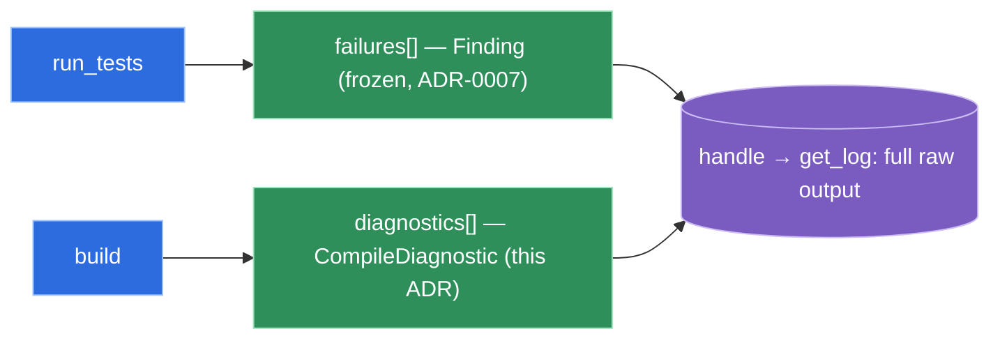

# `build` surfaces compile errors as a build-specific `CompileDiagnostic`, not the test-result schema

**Status:** accepted (2026-06-04)

The `build` verb represents a compile failure as a **new, build-specific record**
`CompileDiagnostic{file, line, col, severity, message}`, carried in the envelope as a top-level
**`diagnostics[]`** array (sibling to — never folded into — the test-failure `failures[]`). Diagnostics
are parsed from the maven-compiler-plugin's structured console lines
(`[ERROR] <file>:[<line>,<col>] <message>`); the full raw compiler output is retained behind the run's
`handle` for `get_log`. The frozen test-result schema (`Finding`/`SourceRef`, ADR-0007) is **left
untouched**. (Decision-log **D33**; complements **D25**, which routes a compile failure *during
`run_tests`* to the operational error `REPORT_NOT_PRODUCED` and hands compile-error parsing to `build`.)

## Why

A compile diagnostic is not a test result and does not fit the frozen schema:

- It has **no test identity** — there is no suite / test / path to populate a `TestFinding`, and no
  natural container for a `ContainerFinding`.
- It has **no test `Outcome`** — `PASSED` / `FAILED` / `ERRORED` / `SKIPPED` are meaningless for "the
  code did not compile"; forcing `ERRORED` overloads an enum ADR-0007 defined for test execution.
- It needs a **column**, which the frozen `SourceRef{file, line}` deliberately does not carry.

Folding compile errors into `ContainerFinding(FILE)` would therefore stretch a schema ADR-0007
explicitly froze as *test-result* semantics, drop the column, and force a misleading outcome. A separate
shape keeps the freeze honest and lets the agent branch deterministically on the **verb** (`failures[]`
for `run_tests`, `diagnostics[]` for `build`).

**Console-parse is unavoidable here, and contained.** D8 rejects stdout-scraping of *test* results in
favor of report files — but a compile failure produces **no report file** (Surefire XML is simply
absent), so the compiler console is the only source. The hazard D8 names (locale/color/version
fragility) is contained because the **`file:[line,col]` coordinates are locale-independent** — only the
human message text is localized, and that text is passed through as untrusted content (P9), never parsed
for meaning. Encoding is pinned via the existing UTF-8 build args (DESIGN §7).

## Considered options

- **New `CompileDiagnostic` + `diagnostics[]` (chosen).** Honest schema, carries the column, frozen
  test schema untouched, deterministic agent branch by verb.
- **Reuse `ContainerFinding(FILE)` (rejected).** One `failures[]` shape for test and build, but forces
  `outcome=ERRORED`, loses the column, and stretches the ADR-0007 freeze beyond test results.
- **Tracer with no parser — pass/fail + `handle` only (rejected).** Smallest slice, but discards the
  `file:line` differential that is the whole reason `build` is worth more than the removed Bash; the
  agent would `get_log` and re-parse compiler output itself.

## Consequences

- A second top-level failure array exists in the envelope (`failures[]` vs `diagnostics[]`). The common
  envelope stays common in its frame (`ok`, `verb`, `manager`, `summary`, `handle?`); the failure
  payload is verb-shaped. Documented in `tool-catalog.md`.
- `CompileDiagnostic.severity` carries `ERROR` and `WARNING`. On a failed build the `ERROR` entries are
  the signal; warnings are included but non-blocking. A successful build returns the minimal payload
  (`{ok:true, summary:{errors:0, warnings:N}}`), consistent with the success contract for tests.
- The parser is **maven-compiler-plugin-shaped**. Other ecosystems' build diagnostics (tsc, `go build`,
  …) reuse the `CompileDiagnostic` *shape* but need their own console parser — inherited by later PRDs,
  exactly as ADR-0008 is inherited.
- If a future requirement needs structured *expected/actual* or multi-line spans, extend
  `CompileDiagnostic` — not the frozen `Finding` graph.
