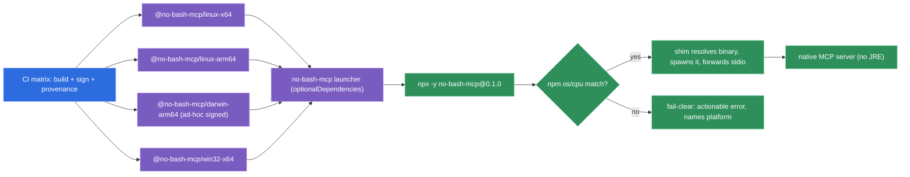

# The native binary ships through an npm/npx launcher with per-platform packages, not a runtime download

**Status:** accepted (2026-06-05)

The MCP server is distributed as a GraalVM native image, yet the **primary distribution channel is
npm/npx** (the esbuild / biome / turbo model). The harness's MCP config invokes `npx`, which resolves
and runs the exact OS×arch binary; the Bootstrap skill — which already writes `.mcp.json` — emits that
invocation with an **exact version pin**. A thin launcher package `no-bash-mcp` declares per-platform
**`optionalDependencies`** (`@no-bash-mcp/<os>-<arch>`), each carrying exactly one native binary and
gated by npm `os`/`cpu`; npm installs only the matching one and **never** downloads at install time.
The v1 matrix is the four tuples GraalVM native-image for JDK 25 supports; macOS arm64 binaries are
ad-hoc codesigned in CI; all packages publish with npm provenance.

The `.mcp.json` contract the Bootstrap skill writes:

```json
{
  "mcpServers": {
    "no-bash-mcp": {
      "command": "npx",
      "args": ["-y", "no-bash-mcp@0.1.0"]
    }
  }
}
```

The pin (`no-bash-mcp@0.1.0` — `0.1.0` is illustrative; the real pin is whatever version is current,
`0.x` pre-1.0 per the binding versioning policy) is **exact, never `@latest`**.

## Why

The goal is **npx-transparency**: the agent's config points at a versioned package name and the right
binary materializes, with no install ceremony the user must perform or trust. npm's `os`/`cpu` fields
select the precise OS×arch package — a precision the MCP-bundle `platform_overrides` mechanism cannot
match (it keys on `process.platform` only, never arch). Tamper-evidence comes free from the npm
registry's tarball hash (`dist.integrity`, SHA-512) plus the exact version pin (D-PIN) — there is
**no committed lockfile** in the npx invocation model, so reproducibility rests on exact pins (the
top-level pin here, and the published package pinning its platform `optionalDependencies` exactly),
not on a checked-in `package-lock.json`; provenance adds a verifiable origin attestation on top. Node is a near-certain
dependency already, because Claude Code itself ships via npm — so the channel reuses what is present
rather than asking for something new.

A native image is **per-platform** (gotcha **G3**): "any OS" is a CI build matrix, not one artifact.
The launcher topology turns that matrix into a clean install-time selection instead of a runtime
guessing game. The decisions below pin how.

- **D-CHANNEL — npm/npx is primary.** `.mcp.json` invokes `command="npx"`,
  `args=["-y","no-bash-mcp@<exact-version>"]`. The Bootstrap skill already writes `.mcp.json`, so this
  is a config-write, not a new step. **Honest tension, stated not hidden:** the native-image
  distribution argument (`build-and-distribution.md`, "runs without a JRE installed") sells freedom
  from a runtime, yet npm reintroduces a **Node** dependency — for *install*, not *execution*. Node is
  near-certain present (Claude Code ships via npm); execution remains a pure native process.

- **D-TOPOLOGY — `optionalDependencies` only, zero runtime download.** A thin JS shim package
  `no-bash-mcp` declares per-platform scoped packages `@no-bash-mcp/<os>-<arch>` as
  `optionalDependencies`, each carrying exactly one native binary and gated by npm `os`/`cpu`. npm
  installs only the matching package; the shim resolves its path and spawns it, forwarding stdio.
  There is **no postinstall network fetch**. If no platform package resolves, the shim emits a clear,
  actionable error (it names the platform and points at the deferred secondary channel). esbuild
  **moved off** postinstall-download precisely because it is fragile (`--ignore-scripts`, corporate
  proxies, airgapped CI) **and** a supply-chain vector (an unverified fetch executed at install).
  Reintroducing it would contradict a tool whose whole thesis is removing a dangerous permission.
  **Publishing order matters:** publish every platform package *before* the launcher, so its
  `optionalDependencies` resolve on first install (race avoidance).

- **D-MATRIX — v1 matrix is the four GraalVM-JDK-25 tuples.** `linux-x64`, `linux-arm64` (aarch64),
  `darwin-arm64` (Apple Silicon), `win32-x64`. This is **dictated by the toolchain**, not a judgement
  call: `win32-arm64` has no GraalVM JDK-25 toolchain, and `darwin-x64` (Intel) is deprecated upstream
  (25.0.1 the last release; future is arm64-only). Each tuple's native support is verified in CI
  before it is promised (extends gotcha **G15**). Source: GraalVM **JDK_25 release notes**.

- **D-SIGNING — macOS arm64 ad-hoc codesign is mandatory.** `codesign -s -` (free) runs in CI **after**
  all post-processing (strip, etc.). Apple Silicon enforces that all native arm64 code must be signed
  or the OS refuses to execute it — and a linker-only or corrupt signature is *worse* than none: it
  draws a `SIGKILL`. The smoking gun is **OpenAI's codex CLI** (May 2026, GitHub
  `openai/codex#21199`): installed via `npm install -g`, its Darwin arm64 binary fails to spawn with
  `Unknown system error -88` — proving the npm channel does **not** exempt a binary from arm64 signing.
  Do **not** rely on GraalVM/linker auto-signing (it may be the corrupt linker-only signature that gets
  killed, or be invalidated by later post-processing). npm-extracted files do **not** carry the
  `com.apple.quarantine` bit, so Gatekeeper's *notarization* gate is never triggered on this channel —
  therefore **ad-hoc is sufficient** here. Paid signing (Apple Developer ID + notarization; Windows
  OV/EV certs) is deferred and coupled to the secondary channels (see Consequences).

- **D-PIN — the Bootstrap skill writes an exact version pin.** `npx -y no-bash-mcp@0.1.0`, never a
  float (`@latest`). A tool whose thesis is removing a dangerous permission must **not** silently
  auto-update its own security-critical binary; updates are an explicit action (re-run bootstrap, or
  bump the pin). The result is reproducible and auditable.

- **D-PROVENANCE — publish with npm provenance.** All packages publish with `npm --provenance`
  (GitHub Actions OIDC → Sigstore), yielding a verifiable build attestation: which repo, commit, and
  workflow produced the artifact. It is the **origin** layer on top of the registry tarball hash
  (which gives only tamper-evidence). Free, high-value for a security tool, and composes with a wider MCP trust framework
  later.



(Platform packages publish before the launcher — left-to-right is the publish dependency order, not
just the data flow.)

## Considered options

- **npm/npx launcher + `optionalDependencies`, zero download (chosen).** npx-transparent, exact
  OS×arch selection via `os`/`cpu`, tamper-evidence from the registry tarball hash + exact pin, origin from provenance, no fragile
  install-time fetch. Reuses Node, which is present anyway. Pure native footprint at *execution*.

- **`.mcpb` (MCP Bundle, ex-DXT) as primary (rejected).** The MCP ecosystem's own one-click desktop
  format (`server.type="binary"`, self-contained, supported by Claude Desktop / Claude Code /
  MCP-for-Windows) — but its **manifest has zero integrity or signing fields**, so trust would have to
  be bolted on externally (e.g. a separate framework), which is weak for a *security* tool; its
  `platform_overrides` is keyed by `process.platform` (`win32`/`darwin`/`linux`) with **no `${arch}`
  variable**, making per-arch packaging awkward (one bundle per OS×arch, or a launcher inside the
  bundle); and it **sets MOTW/quarantine**, which forces the paid notarization this ADR defers.
  Deferred to the roadmap as a parallel desktop channel. Source: `modelcontextprotocol/mcpb`
  **MANIFEST**.

- **`curl | sh` / Homebrew / Scoop PATH-installers as primary (rejected).** Truest to the native
  thesis (zero runtime dependency, no Node) — but each needs a **discrete install step** the user must
  run *and* the **paid signing** (notarization, OV/EV) that the npm channel sidesteps via the missing
  quarantine bit. Deferred as secondary channels.

- **Postinstall network download as the topology (rejected).** The classic single-package model, but
  the exact pattern **esbuild abandoned**: fragile under `--ignore-scripts`, corporate proxies, and
  airgapped CI, and a supply-chain vector (an unverified fetch executed at install time). Adopting it
  would contradict the product's reason to exist.

- **A JVM-jar fallback in v1 (rejected).** A jar would cover the uncovered platforms (`win32-arm64`,
  `darwin-x64`) — but it **reintroduces the JRE dependency native image exists to kill**. YAGNI until
  there is evidence of a real user on those platforms; deferred to the roadmap as an explicit escape
  hatch.

## Consequences

- **A thin Node shim sits in front of the native process for the whole session (D-FOOTPRINT).** It
  pipes stdio and adds roughly **30–50 MB RSS** plus the Node dependency. This **undercuts** the
  "low-RAM native" footprint argument in `build-and-distribution.md` and is accepted **eyes-open**:
  esbuild does the same, and Node is present anyway. Rejected alternative — having Bootstrap rewrite
  `.mcp.json` to point straight at the resolved native binary path (pure native footprint) — because
  it makes `.mcp.json` machine-specific and brittle and forfeits npx ergonomics.

- **Node is required for install, not execution.** The native binary itself runs without a JRE *or*
  Node; npm/npx is the delivery and selection mechanism. The honesty cost is that the "no runtime"
  pitch now means "no *Java* runtime at execution," not "no runtime at all at install." Stated, not
  buried.

- **A CI matrix obligation, extending G15.** Each of the four tuples must have its GraalVM JDK-25
  native support **verified in CI before it is promised** to a user (G15 already requires confirming
  GraalVM native-image supports JDK 25; this widens it to a per-tuple gate). The macOS arm64 leg
  additionally runs `codesign -s -` *after* post-processing; all legs publish with `--provenance`; and
  platform packages publish **before** the launcher.

- **Uncovered platforms fail clear, with an emulation bridge.** `win32-arm64` and `darwin-x64` (Intel)
  get no v1 package; the shim errors actionably (naming the platform and the deferred secondary
  channel) rather than silently doing nothing. `win32-arm64` can run the `win32-x64` build under
  Windows emulation meanwhile.

- **Paid signing remains deferred, coupled to the secondary channels.** The moment a binary arrives via
  a channel that sets MOTW/quarantine (curl/browser download, `.mcpb`), Gatekeeper's notarization gate
  fires and an unsigned `.exe` via browser hits SmartScreen — so Apple Developer ID + notarization
  (~$99/yr) and a Windows OV/EV cert become required *then*, not now. The npm channel's missing
  quarantine bit is what lets v1 stop at ad-hoc.

- **Composes with ADR-0008's trust posture.** The launcher and binaries are shipped and
  provenance-attested by the project's own CI, with the darwin-arm64 binary additionally ad-hoc
  codesigned — they are *trusted* artifacts the server invokes, consistent with ADR-0008's rule that
  the system runs trusted launchers, never agent-rewritable wrappers. The pin (D-PIN) keeps the
  security-critical binary from drifting under the agent.
