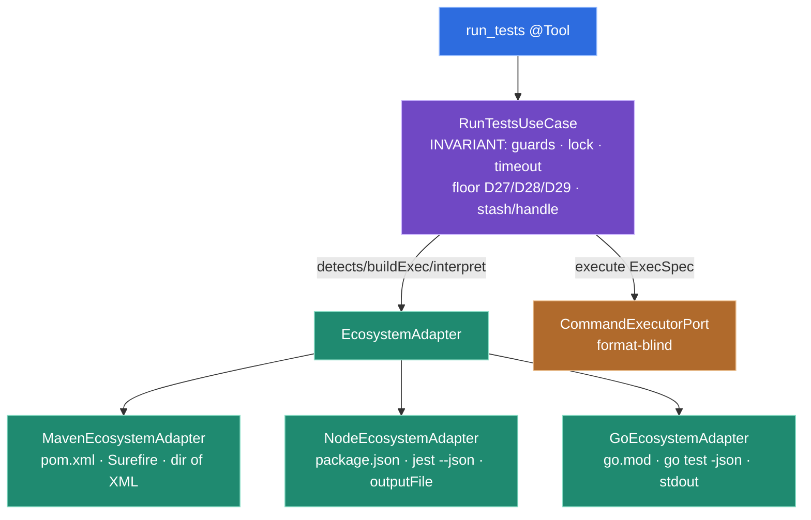

# Ecosystem dispatch: one ecosystem-agnostic `run_tests` use-case over per-ecosystem strategy adapters

**Status:** **accepted** (2026-06-05) — grilled in `grill-with-docs` while scoping **PRD-3**
(Node + Go ecosystems). Records the structural decision behind decision-log **D46–D49**. Extends
[ADR-0006](./0006-application-architecture.md) (hexagonal + per-verb slices): this ADR governs how a
single verb (`run_tests`) dispatches across **multiple** ecosystems without duplicating its
invariant logic. The `/prototype` already proved the two data-model bets this rests on — the
universal schema folds all three report formats, and `CommandExecutorPort` stays format-blind
(report-source even differs: file for Maven, stdout for Go) — evidence:
[`prototype/NOTES.md`](../../prototype/NOTES.md). The Node (jest 30.4.1) and Go (1.26) compile-fail
shapes were additionally de-risked empirically during this grill — see
[`schema-divergence-map.md`](../design/schema-divergence-map.md).

## Context

`run_tests` shipped Maven-only (PRD-1). `RunTestsUseCase` interleaves two very different kinds of
logic:

- **Ecosystem-invariant orchestration** — the per-module lock (ADR-0005/D22), the timeout intercept
  + process-tree kill (issue #6), and the **entire anti-false-green failure floor**: report freshness
  by construction (D27), the process-exit floor (D28), and the positive-evidence `executedTests > 0`
  / `NO_TESTS_RUN` floor (D29), plus the run-cache `handle`/`get_log` stash (D17).
- **Maven-specific detail** — the `pom.xml` marker, the `mvn` launcher, the `ArgvBuilder` argv +
  `-Dsurefire.reportsDirectory` injection, the `SurefireNormalizer`, and the report **source**
  (a directory of `*.xml`).

PRD-3 adds Node (jest) and Go normalizers behind the proven `CommandExecutorPort`. The danger is
**where the invariant floor lives**. The anti-false-green floor is the project's most heavily
defended invariant — four chained decisions (D27–D30) hardened under adversarial review, closing the
G5 lossy-summary class. If each ecosystem owned its own copy of that floor, there would be **three
places** a future edit could reopen a false-green hole, and every future ecosystem author
(Python/Rust/.NET are on the roadmap) would have to re-derive it correctly.

## Decision

- **Introduce an `EcosystemAdapter` strategy** capturing exactly what varies per ecosystem; keep
  `RunTestsUseCase` ecosystem-agnostic, owning the invariant orchestration. Sketch:

  ```java
  interface EcosystemAdapter {
      boolean detects(Path dir);                 // marker + test signal (D52): pom.xml / go.mod /
                                                 // package.json WITH a recognized framework (jest|vitest|mocha) —
                                                 // never a bare package.json (tooling-only repos must not match)
      String managerBinary();                    // mvn / npm / go — trusted, PATH-resolved (ADR-0008)
      boolean isInstalled();                     // managerBinary() resolves on PATH → TOOL_NOT_INSTALLED guard
      Optional<OperationalError> preflight(Path dir);   // DEPS_NOT_INSTALLED (Node) — empty for Maven/Go (D21)
      ReportPlan buildExec(Path dir, List<String> vettedFlags, int timeoutSeconds,
                           @Nullable TestTarget target);  // ExecSpec + the FRESH report target + how to read it
      RunInterpretation interpret(ExecResult result, ReportPlan plan);  // read source, normalize → NormalizedRun
                                                                        // OR an operational error (no-report case)
  }
  ```

- **The invariant floor stays in the use-case, single-source.** `RunTestsUseCase` runs the fixed
  spine for every ecosystem: pre-exec guards → lock → `adapter.buildExec` → `executor.execute` →
  **timeout intercept (D28 first)** → `adapter.interpret` → the **D28/D29 floor over the returned
  `NormalizedRun`** → stash + assemble the success / test-failure / operational-error envelope. Only
  the **`Summary`-filling** varies (each normalizer counts into the same `Summary`); the floor that
  *consumes* the `Summary` does not.

- **The adapter owns the report-absence asymmetry.** `interpret` is where the divergence the schema
  map records is resolved: Maven's empty fresh dir → operational `REPORT_NOT_PRODUCED` (no report to
  fold, D25); Go's `build-fail` JSON event and jest's empty-`assertionResults` suite → a **folded**
  `ContainerFinding(ERRORED)` (ADR-0007 rule 4). The use-case never special-cases an ecosystem.

- **Three concrete adapters, no SPI / discovery (YAGNI).** `MavenEcosystemAdapter` (the existing
  Maven code refactored in), `NodeEcosystemAdapter` (jest for the tracer; vitest/mocha later), and
  `GoEcosystemAdapter`. They are `@Singleton` beans; `RunTestsUseCase` selects the one whose
  `detects(dir)` matches. No registry, no classpath scanning, no plugin manifest — a concrete
  interface with three wired implementations.

- **`CommandExecutorPort` stays format-blind**, but its Maven-bound `isManagerInstalled()` moves
  behind the adapter (the adapter knows its `managerBinary()`); the port keeps `execute(ExecSpec)`
  and gains an installed-check that takes the binary, so one executor serves all ecosystems.

- **First slice = a pure refactor tracer.** Extract `EcosystemAdapter` with **Maven as the sole
  adapter** and all existing tests green, *before* any Node/Go code lands. This proves the
  abstraction against the already-working ecosystem (the tracer-bullet discipline), de-risking the
  seam before new normalizers are added.



## Why (the trade-off)

- **The deciding argument is correctness/security, not DRY.** Keeping the anti-false-green floor in
  one place means there is exactly **one** implementation of D27–D30 to audit and to protect with the
  existing adversarial tests; a new ecosystem cannot reopen a false-green hole by omission, because it
  never touches the floor — it only fills a `Summary` and returns findings. The real divergence
  (report-source file-vs-stdout; no-report → operational-vs-folded) is precisely what the adapter
  **encapsulates**, so "shared floor" is not an illusion: the floor consumes an already-normalized
  result.
- **Rejected: separate per-ecosystem use-cases** (`MavenRunTestsUseCase` / `Node…` / `Go…` + a
  router). Simpler per ecosystem, but **duplicates the D27–D30 floor + lock + timeout + stash three
  times** — three audit surfaces, three chances to drift, and a re-derivation burden on every future
  ecosystem. The floor's hard-won correctness is the wrong thing to copy-paste.
- **Rejected: a plugin SPI / service-discovery framework.** Over-engineered for three concrete
  ecosystems (KISS/YAGNI); a concrete interface with three wired beans is sufficient and far easier to
  reason about. Reconsider only if ecosystems become user-pluggable (not on the roadmap).
- The shape mirrors ADR-0006's existing seam philosophy (ports/adapters for what genuinely varies)
  and the `/prototype` finding that normalizer selection belongs in the verb layer.

## Consequences

- **`ErrorCode` grows with PRD-3 (resolved in D50/D52):** `DEPS_NOT_INSTALLED` (Node preflight, D21,
  triggered when the detected framework binary is unresolvable), `UNSUPPORTED_TEST_FRAMEWORK` (a Node
  repo on vitest/mocha while the tracer ships jest), `AMBIGUOUS_SCOPE` (≥2 ecosystems match — fail-closed,
  never a precedence pick), and `INSTALL_FAILED` (the `install` verb). **Detection (D52) keys on a
  marker + an ecosystem-specific test signal, never a bare marker:** Node requires `package.json` *with*
  a recognized framework, so a tooling-only `package.json` in a Java/Go repo cannot spuriously collide
  with `pom.xml`/`go.mod` and regress a working `run_tests`. The `AMBIGUOUS_SCOPE` branch lands in the
  **second** slice (the first with two adapters), keeping the refactor slice a pure, behavior-preserving
  extraction.
- **The `build` verb (`RunBuildUseCase`) is also Maven-bound** but is **out of PRD-3 scope** (D47).
  When build-breadth earns its PRD, it should follow this same `EcosystemAdapter` pattern (or a
  sibling) rather than inventing a second dispatch shape — note it, do not build it now.
- The adapter interface is the **extension point** for every future ecosystem (Python/Rust/.NET);
  adding one is "implement the interface + wire the bean + add fixtures," with the floor untouched.
- ArchUnit (ADR-0006) should gain a rule that **adapters do not depend on each other** and that the
  use-case depends on the `EcosystemAdapter` abstraction, not a concrete adapter.
