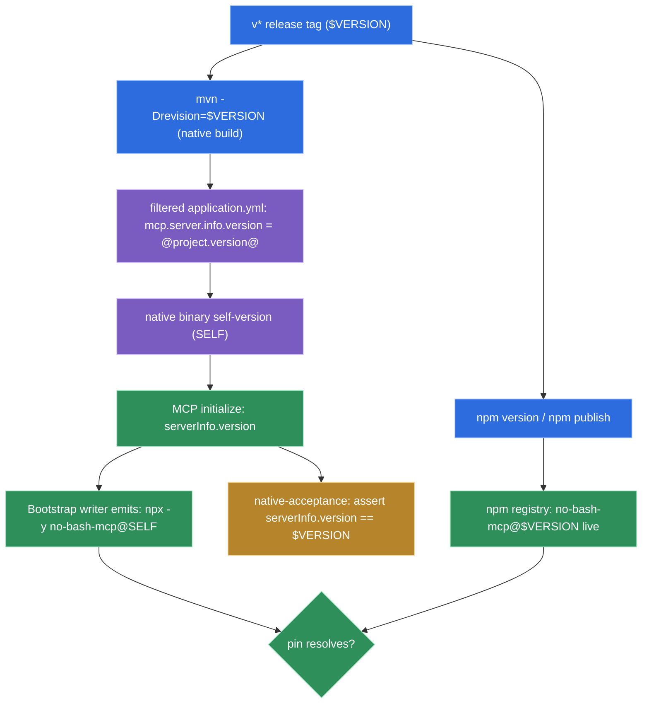

# The exact npx pin is the binary's build-stamped self-version, sourced from a filtered `application.yml` coherent with the npm release

**Status:** accepted (2026-07-07)

[ADR-0010](./0010-npm-launcher-distribution.md) decided the Bootstrap skill writes an **exact**
version pin — `npx -y no-bash-mcp@<exact-version>`, never `@latest` (D-PIN / D42). This ADR decides
**where `<exact-version>` comes from**: it is the running binary's own **self-version**, build-stamped
at release time and guaranteed **coherent** with the version actually published to npm, so the pin
resolves. It closes PRD-5 S4 (#78), which halted (2026-06-15) because that source did not yet exist.

The `.mcp.json` contract is unchanged from ADR-0010; the new decision is the provenance of the pin:

```json
{
  "mcpServers": {
    "no-bash-mcp": {
      "command": "npx",
      "args": ["-y", "no-bash-mcp@0.0.1-alpha.2"]
    }
  }
}
```

`0.0.1-alpha.2` is illustrative — the real pin is whatever version the running binary was stamped
with, which by construction equals a version live on npm.

## Why

The halt found three coupled gaps: no runtime mechanism by which the binary knows its released
version; the Maven project version (`-SNAPSHOT`) decoupled from the published npm version; and the
only automated gate (`mvn clean test`) structurally blind to the deliverable (a **sentinel** version
in the golden test goes green for an unresolvable pin). A grilling session (2026-07-07, decision-log
**D61**) resolved each.

- **D-SELFVERSION — the pin is the binary's own build-stamped self-version.** The version is not
  computed at runtime and not a floating tag; it is baked in at build time and read back at runtime.
  A tool whose thesis is removing a dangerous permission must pin its security-critical binary to an
  auditable, machine-independent value (D42) — the binary's own identity is that value.

- **D-COHERENCE — one release tag feeds both the build and the publish.** The Maven version is
  `${revision}` (default `0.1.0-SNAPSHOT`); the CI native build passes `-Drevision=$VERSION`, the
  **same** `$VERSION` derived from the `v*` tag that drives `npm version`/`npm publish`. Release N
  stamps the binary N **and** publishes npm N in one run, so a user who installs N and runs Bootstrap
  writes `@N` — already live. Coherence is **by construction**, not a reconciliation step; the
  #77 "a published resolvable version must pre-exist" ordering constraint dissolves (and S3's
  `v0.0.1-alpha.2` publish already satisfied it). **No `flatten-maven-plugin`** is needed because
  nothing consumes the pom — distribution is npm-only; `<repositories>`'s `central` is a *source*
  repo, not a publish target.

- **D-CARRIER — the stamp lives in a filtered `application.yml`, surfaced via `serverInfo`.** Maven
  resource-filtering writes `mcp.server.info.version: @project.version@` (using `@…@` delimiters,
  `useDefaultDelimiters=false`, to avoid the Maven↔Micronaut `${}` placeholder collision).
  `application.yml` is **already** on the native-image resource path (the PRD-4 binary boots and
  reads it) and the key **already** feeds the MCP `initialize` `serverInfo.version`: the micronaut-mcp
  module binds `io.micronaut.mcp.conf.server.McpServerInfoConfigurationProperties` at prefix
  `micronaut.mcp.server.info` (verified in `micronaut-mcp:1.0.0` — the config schema declares the
  `version` property at path `micronaut.mcp.server.info.version`, and the module populates
  `McpSchema.InitializeResult.serverInfo`). So a single source feeds three consumers: the
  `serverInfo.version` the client sees, the exact pin the writer emits, and the native-acceptance
  coherence assertion. This is GraalVM-native-safe on an **already-proven** surface, and it makes the
  #78 "demonstrate on a hand-built native binary" criterion nearly free. **Caveat for the `/tdd`
  slice:** `native-acceptance.yml` today drives `initialize` but asserts only the **tools/list**
  catalog, not the version field — the `serverInfo.version` assertion is a **new leg** to add, not an
  existing one to reuse.

- **D-PUREWRITER — `HarnessConfigWriter` stays a pure faithful emitter.** It keeps taking the version
  as an **injected** parameter (replacing today's injected `jarPath`), flipping
  `command:"java", args:["-jar", <jar>]` → `command:"npx", args:["-y", "no-bash-mcp@<version>"]`. No
  live caller is wired in this slice: the Bootstrap skill is not a v1-shipped deliverable, and the
  runtime-invocation surface (an MCP verb vs a CLI subcommand that reads `serverInfo.version` and
  calls the writer) is deferred post-v1. Injection keeps the golden test deterministic.

- **D-DEVPIN — a non-release build emits a deliberately-unresolvable pin, failing loud at use.** A
  local/dev binary reports `0.1.0-SNAPSHOT`, so the writer emits `npx -y no-bash-mcp@0.1.0-SNAPSHOT`,
  which `npx` rejects loudly ("no matching version") on first use. This is an exact pin (D42-clean),
  never `@latest`. The up-front fail-closed refusal is deferred with the live caller; the contract is
  **bootstrap only from a released binary.**

- **D-GATE — sentinel unit golden stays; native-acceptance carries the real proof.** The golden and
  merge tests keep injecting a fixed sentinel version (deterministic, no live-npm coupling). The
  loop-closer the JVM gate is structurally blind to lives on the native gate: `native-acceptance.yml`,
  on the hand-built binary it already drives through `initialize`, gains an assertion on
  `serverInfo.version`. Because the writer emits `@<that same self-version>`, proving `serverInfo`
  equals the build's stamped version proves the emitted pin is internally coherent — the #57
  native-invisible-to-JVM precedent applied to versioning. **Two timings, deliberately:**
  `native-acceptance.yml` runs on **both** PRs to `master`/`development` **and** the release tag
  (`push` + `pull_request` + `workflow_call`). On a **PR** there is no tag, so `${revision}` defaults
  to `0.1.0-SNAPSHOT`; the assertion proves *plumbing coherence* — `serverInfo.version` reflects the
  `${revision}` the build used, and the writer would emit that same value. The *resolvability
  coherence* (`serverInfo.version == the live npm version`) is provable only at **release time**,
  where the tag build runs `-Drevision=$VERSION` and `npm publish $VERSION` in the same run — so the
  release leg asserts `serverInfo.version == $VERSION`. A green slice PR therefore proves the wiring,
  not that a pin resolves against the registry; that is the tag gate's job.



(`SELF` is the binary's build-stamped self-version; `$VERSION` is the release tag. `D-COHERENCE`
makes `SELF == $VERSION`, so the emitted pin resolves against the registry entry the same tag
publishes.)

## Considered options

- **Filtered `application.yml`, surfaced via `serverInfo` (chosen).** One build-stamped source feeds
  `serverInfo`, the writer's pin, and the native assertion. Native-safety is already proven (the
  binary boots and reads the yml natively); the AC3 native-proof surface already exists in the
  `initialize` handshake native-acceptance drives. Its one trap — the Maven↔Micronaut `${}` delimiter
  collision — is a one-line `@…@` delimiter configuration.

- **A generated `BuildInfo.VERSION` constant (rejected).** A `templating-maven-plugin`-generated
  `public static final String VERSION = "@project.version@"` is also native-safe (a compile-time
  literal folds into the image, needing no resource registration) and dodges the delimiter collision.
  But it is a **second** version surface that would have to be reconciled with the value `serverInfo`
  already reads from `application.yml` — duplicate sources of the same truth. One source is lazier and
  more honest.

- **Manifest `Implementation-Version` (rejected).** `maven-jar-plugin` could emit it, but native-image
  strips/does-not-preserve it reliably, and the JVM jar is not the shipped artifact. Unfit for the
  native binary.

- **`@latest` / a floating tag (rejected by ADR-0010 / D42).** Would let the registry swap the
  executing binary out from under the harness with no audit trail — exactly the invisible drift this
  tool exists to eliminate.

- **A separate CI-only stamp with a static pom (rejected).** Leaving `project.version` at
  `0.1.0-SNAPSHOT` and stamping the carrier independently keeps the Maven version dishonest and
  creates a second source of truth — the very decoupling this slice removes.

- **Resolving the pin against live npm in the unit test (rejected).** Non-deterministic,
  network-coupled, flaky, and still blind to the native-stamped value; the real resolvability proof
  belongs on the native gate.

## Consequences

- **`project.version` becomes `${revision}`** — a Maven multi-module idiom used here for release-time
  stamping. Local builds default to `0.1.0-SNAPSHOT`; the CI native build overrides via
  `-Drevision=$VERSION`. No `flatten-maven-plugin` obligation because the pom is not a published/
  consumed artifact.

- **`application.yml` is a filtered resource.** The `@…@` delimiter and `useDefaultDelimiters=false`
  configuration is mandatory; a lapse re-introduces the Maven↔Micronaut `${}` collision. The one
  filtered key is `mcp.server.info.version`.

- **`serverInfo.version` gains a contract.** It is no longer a decorative literal (`0.1.0`) — it is
  the machine-checked self-version, asserted by native-acceptance (equal to the release tag at release
  time), and read (eventually) by the Bootstrap caller. Changing how it is sourced now has downstream
  teeth.

- **A non-release binary's pin does not resolve — on purpose.** Anyone running Bootstrap from a
  locally-built binary gets a loud `npx` failure, not a silently-broken config. The friendlier
  up-front refusal is a deferred caller-side enhancement.

- **The native gate owns version correctness.** `native-acceptance.yml` grows one **new** assertion
  on `serverInfo.version` (today it drives `initialize` but asserts only the tools/list catalog). The
  JVM suite deliberately cannot prove this; a green `mvn test` is no longer mistaken for a resolvable
  pin. The assertion runs at two strengths (see D-GATE): plumbing coherence on PRs, full
  `== $VERSION` resolvability coherence on the release tag. A slice PR being green does **not** prove
  a pin resolves against the registry — only the tag gate does.

- **Composes with ADR-0010.** The channel, topology, signing, and provenance decisions are unchanged;
  this ADR only fixes the provenance of the exact pin ADR-0010's D-PIN already mandated.
