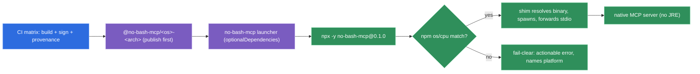

# Build & Distribution

> **PRD split (decision-log D53).** This document spans two PRDs. **Building & hardening** the native
> binary of the real server (the sections through *Platform matrix* + *Signing*) is **PRD-4** — it
> proves the binary across the 4-tuple matrix and emits the signed binaries as CI artifacts.
> **Delivering** it (the *npm/npx launcher*, *topology*, *version pin*, *provenance*, *footprint*
> sections) is **PRD-5**, which consumes PRD-4's artifacts. Ad-hoc `darwin-arm64` signing sits in
> **PRD-4** (it is a prerequisite for *verifying* the darwin tuple — an unsigned arm64 binary is
> SIGKILLed; D54). `--static-nolibc` is a **linux-only** criterion; darwin/win ship system-dynamic
> (D55). ADR-0010 remains the channel's authority, now owned by PRD-5.

## Baseline

- **Micronaut 5.0.0**, **Java 25** baseline, build with **Maven**.
- **Micronaut MCP 1.0.0** (GA, in the 5.0 platform; MCP Java SDK 1.1.2), **STDIO** transport.
- Verify **GraalVM native-image for JDK 25** is available in CI before relying on the native build
  (gotcha **G15**).

## Two-phase: JVM core, native at release

- **Develop + test on the JVM** — fast iteration, a single cross-platform artifact.
- **GraalVM native image at release** — produced from the same Micronaut codebase.

## Why native (and why *not* for the reason people assume)

The usual selling point of native image is **startup speed** — and that **does not apply here**.
The MCP is a session-lived STDIO server that warms up **once** per session; JVM warmup is amortized
across the whole session and is marginal.

The reasons that **do** apply:

1. **Distribution** — a self-contained binary that runs **without a JRE installed**. Huge for the
   "works on any OS" goal and for zero-friction adoption.
2. **RAM footprint** — low memory for the *server process* that idles in the background all session.
   (Caveat: the npx delivery model keeps a thin Node shim in front of the native process, so the
   *whole-session* footprint is higher than the native process alone — see **Accepted cost** below.)

## Cost accepted

- Native image is **per-platform** → "any OS" means a **CI build matrix**
  (linux / macos / windows × arch), not a single artifact. See gotcha **G3**. The v1 matrix is pinned
  to four tuples below (it is dictated by the GraalVM JDK-25 toolchain, not a judgement call).
- Mitigation: **Micronaut is AOT-native by design** (reflection/resource config generated at
  compile time), so the classic native-config pain is low. **`ProcessBuilder` subprocess spawning in a
  native image is a PRD-4 native-proof obligation, not an assumed fact** (decision-log **D55**): the s2
  spike's `PingTool` never spawned a subprocess, yet subprocess spawning is the entire product mechanic
  — so PRD-4's native acceptance IT must drive a real `mvn`/`go`/`npm` spawn *through the binary*,
  capturing any reachability/resource metadata it needs.

## Positioning

Native image is **packaging**, not the thesis. The security + structured-output mechanic works
identically on the JVM, so native must **not** gate the core mechanic or its feedback loop.

## How users get it — the distribution channel

The native binary ships through an **npm/npx launcher** — the esbuild / biome / turbo model. The
authority for the full rationale and rejected alternatives is
**[ADR-0010](../adr/0010-npm-launcher-distribution.md)**; this section records the *what & why* at a
glance.

### Primary channel — npm/npx launcher (D-CHANNEL)

The harness's MCP config (`.mcp.json`) invokes `npx`, which resolves and runs the exact OS×arch
binary. The Bootstrap skill — which **already** writes `.mcp.json`
([bootstrap-and-deployment.md](./bootstrap-and-deployment.md)) — emits this invocation, so it is a
config-write, **not** a new install step:

```json
{
  "mcpServers": {
    "no-bash-mcp": {
      "command": "npx",
      "args": ["-y", "no-bash-mcp@0.1.0"]
    }
  }
}
```

**Why npm/npx:** it matches the user's npx-transparency anchor; npm's `os`/`cpu` fields select the
precise OS×arch package (a precision that bundle `platform_overrides` cannot give — it keys on
`process.platform` only, never arch); tamper-evidence comes free from the npm registry's tarball
hash (`dist.integrity`, SHA-512) plus the exact version pin (the npx model has **no committed
lockfile**, so reproducibility rests on exact pins, not a checked-in `package-lock.json`).

**Honest tension (stated, not hidden):** "Why native" above sells the binary as *runs without a
runtime installed*, yet npm reintroduces a **Node** dependency at **both** install (package
resolution) **and** runtime — the **Launcher** is a Node process that stays in front of the native
binary for the whole session, piping stdio (see *Accepted cost* below, D45). Node is near-certain
present because Claude Code itself ships via npm. What stays runtime-free is the server's *work*:
the actual MCP operations run in the **native binary**, not in Node — but a Node launcher process is
resident alongside it the whole session.

### Topology — `optionalDependencies` only, zero runtime download (D-TOPOLOGY)

A thin launcher package `no-bash-mcp` (a small JS shim) declares per-platform **scoped** packages
`@no-bash-mcp/<os>-<arch>` as `optionalDependencies`, each carrying exactly **one** native binary and
gated by npm `os`/`cpu`. npm installs only the matching one; the shim resolves its path and spawns
it, forwarding stdio.

- **No postinstall network fetch.** esbuild *moved off* postinstall-download because it is fragile
  (`--ignore-scripts`, corporate proxies, airgapped CI) **and** a supply-chain vector (an unverified
  fetch executed at install) — reintroducing it would contradict a tool whose thesis is removing a
  dangerous permission.
- **Fail-clear.** If no platform package resolves, the shim emits a clear, actionable error — it
  names the platform and points at the deferred secondary channel.
- **Publishing order matters.** Publish **every platform package before the launcher**, so its
  `optionalDependencies` resolve on first install (race avoidance).



### Platform matrix — the four GraalVM JDK-25 tuples (D-MATRIX)

| Tuple | Notes |
|---|---|
| `linux-x64` | supported |
| `linux-arm64` (aarch64) | supported |
| `darwin-arm64` (Apple Silicon) | supported; **ad-hoc codesigned** in CI |
| `win32-x64` | supported |

This set is **dictated by the toolchain**, not a judgement call: `win32-arm64` has no GraalVM JDK-25
toolchain, and `darwin-x64` (Intel) is deprecated upstream (25.0.1 the last release; future is
arm64-only). Each tuple's native support is **verified in CI before it is promised** (extends gotcha
**G15**). Source: GraalVM **JDK_25 release notes**.

**Uncovered platforms** (`win32-arm64`, `darwin-x64`/Intel) **fail clear** — the shim errors
actionably rather than doing nothing silently. A JVM-jar fallback is **deferred** to the roadmap as
an explicit escape hatch (it would reintroduce the JRE dependency native exists to kill — YAGNI until
a real user on those platforms appears). `win32-arm64` can run the `win32-x64` build under Windows
emulation meanwhile.

### Signing — mandatory ad-hoc mac-arm64, paid deferred (D-SIGNING)

macOS arm64 **ad-hoc codesign** (`codesign -s -`, free) in CI, applied **after** all post-processing
(strip, etc.), is **mandatory and non-negotiable**. Apple Silicon enforces that all native arm64 code
must be signed or the OS refuses to execute it, and a linker-only or corrupt signature is *worse*
than none — it draws a `SIGKILL`. The smoking gun is OpenAI's codex CLI (May 2026,
`openai/codex#21199`): installed via `npm install -g`, its Darwin arm64 binary fails to spawn with
`Unknown system error -88` — proving the npm channel does **not** exempt a binary from arm64 signing.
Do **not** rely on GraalVM/linker auto-signing (it can be the corrupt linker-only signature that gets
killed, or be invalidated by later post-processing).

npm-extracted files do **not** carry the `com.apple.quarantine` bit, so Gatekeeper's *notarization*
gate never fires on this channel → **ad-hoc is sufficient** here. **Paid signing** (Apple Developer
ID + notarization, ~$99/yr; Windows OV/EV cert) is **deferred** and coupled to the secondary channels
(curl/browser download and `.mcpb` set MOTW/quarantine, which forces notarization; an unsigned `.exe`
via browser hits SmartScreen, which an EV cert suppresses).

### Version pin — exact, never `@latest` (D-PIN)

The Bootstrap skill writes an **exact version pin** (`npx -y no-bash-mcp@0.1.0`), never a float
(`@latest`). A tool whose thesis is removing a dangerous permission must **not** silently auto-update
its own security-critical binary; updates are an explicit action (re-run bootstrap, or bump the pin).
Reproducible and auditable.

### Provenance — npm `--provenance` (D-PROVENANCE)

All packages publish with **`npm --provenance`** (GitHub Actions OIDC → Sigstore), yielding a
verifiable build attestation: which repo, commit, and workflow produced the artifact. It is the
**origin** layer on top of the registry tarball hash (which gives only tamper-evidence). Free, high-value for a
security tool, and composes with a wider MCP trust framework later.

### Accepted cost — the Node-wrapper footprint (D-FOOTPRINT)

The npx model keeps a **thin Node shim** process in front of the native MCP for the whole session (it
pipes stdio), adding roughly **30–50 MB RSS** plus the Node dependency. This **undercuts** the
"low-RAM native" footprint argument above (the native *process* still idles low; the *whole-session*
total does not) and is accepted **eyes-open**: esbuild does the same, and Node is present anyway.
Rejected alternative — have the Bootstrap skill rewrite `.mcp.json` to point straight at the resolved
native binary path (pure native footprint) — because it makes `.mcp.json` machine-specific and
brittle and forfeits npx ergonomics.

## Deferred secondary channels

Parallel channels are **deferred to the roadmap**, not v1-primary — see **[ADR-0010](../adr/0010-npm-launcher-distribution.md)**
for why each was rejected as primary:

- **`.mcpb` (MCP Bundle, ex-DXT)** — the MCP ecosystem's one-click desktop format
  (`server.type="binary"`, self-contained, supported by Claude Desktop / Claude Code /
  MCP-for-Windows). Not v1-primary: its manifest has **zero integrity/signing fields** (weak for a
  security tool), `platform_overrides` is keyed by `process.platform` with no `${arch}` variable (so
  per-arch packaging is awkward), and it **sets MOTW/quarantine** → forces the paid notarization
  deferred above.
- **`curl | sh` / Homebrew / Scoop PATH-installers** — truest to the native thesis (zero runtime
  dependency, no Node) — but each needs a **discrete install step** *and* the **paid signing** the npm
  channel sidesteps via the missing quarantine bit.
