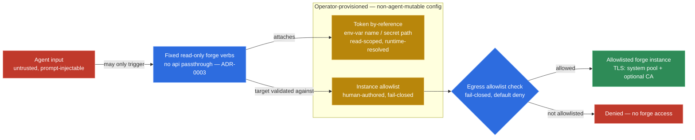

# Forge Security Model

The **second** threat model. [`security-model.md`](./security-model.md) governs **command
execution** (guarantee: no agent-composed *novel command*, via argv). This document governs **forge
inspection**, which is authenticated **HTTP**, not subprocess execution — a distinct attack surface
the command-composition guarantee does not address. One MCP server; two consciously-separate
security domains (see ADR-0002).

## Guarantee

> **"The agent cannot compose an arbitrary HTTP request; it can only trigger fixed, read-only forge
> verbs against a configured, allowlisted forge instance."**

Read-only is enforced at the **token layer** — a read-scoped credential (`read_api` on GitLab; a
read-only fine-grained PAT on GitHub) — not merely by omitting write verbs. A read-scoped token is a
hard capability boundary the agent cannot exceed even under prompt injection.

> **This enforcement is a deployment/provisioning obligation, not a code guarantee** (adversarial review
> of spike `s3`). The code cannot verify a token's scope; the boundary holds only if the **operator
> provisions an actually read-scoped credential**. Spike `s3` validated the *by-reference resolution*
> mechanism only — and did so with a **write-capable** OAuth token, so it provides **zero** evidence that
> a write would be rejected. A `/tdd` test should run a real read-only fine-grained PAT and assert a write
> verb returns 403; absent that, treat token read-scope as an operator-provisioning requirement, surfaced
> in the bootstrap docs, never asserted as a code-level guarantee.

**No generic passthrough.** There is deliberately no `api`-style escape hatch (ADR-0003); it would
reintroduce arbitrary-request composition.

## Threat model — areas (specifics to be pinned during grilling / the forge spike)

1. **Secret management.** The MCP holds/accesses forge tokens (per-instance; multiple GitLab
   instances coexist). Tokens are **never logged, never returned in an envelope, never accepted from
   agent input**. 401 / expiry surface as operational errors with a `hint`. **Tokens are supplied by
   *reference*** — config stores an env-var name / secret path, never the secret inline — resolved at
   runtime (env or vault). Always **read-scoped** (`read_api` / read-only fine-grained PAT). See
   ADR-0004.
2. **SSRF / base-URL allowlisting.** A configurable self-hosted base URL is an attack surface. Only
   **allowlisted forge instances** may be contacted; the agent cannot redirect a verb at an arbitrary
   URL nor add an instance. The allowlist is **human-authored, non-agent-mutable, fail-closed**
   config — the same governance tier as the `run_task` allowlist (D19), **not** the agent-tunable
   non-sensitive-knob tier. Default: no instance → no forge access. It doubles as the future sandbox
   network-egress policy (roadmap). See ADR-0004.
3. **Tier / version gating + operational completeness.** Self-hosted GitLab spans CE/EE/Premium/Ultimate
   and many versions; calls degrade gracefully on 403/404 rather than leaking detail or failing
   cryptically. **Completeness obligations the `s3` spike did NOT exercise (it fit one page / hit only
   `github.com`):** (a) **paginate** list endpoints via the `Link rel=next` header until exhausted — a
   single un-paginated GET to `/check-runs` would miss a failing check on page 2 and **false-green** the
   `ok()` fold; (b) **merge the GitHub Commit Statuses API** (`/commits/{ref}/status`) into the same
   `ContainerFinding(RUN)` fold — a red *status* is invisible to `/check-runs` alone; (c) honor
   **rate-limit / `Retry-After` / secondary-limit** headers (429/403) rather than hammering or failing
   cryptically. These directly defend the `§2`/ADR-0007 "one failed check ⇒ `ok=false`" guarantee.
4. **Expanded untrusted content (P9).** CI job logs and PR/MR/issue bodies are attacker-controllable
   content flowing through the envelope. The neutralize-and-mark-`untrusted` discipline applies with
   **more** weight here than for local output.
5. **Transport security.** TLS trust via the system pool plus an optional private CA; **never**
   disable verification.

### Trust boundary (areas 1 + 2)

The boundary that makes forge inspection safe is the split between what the **agent** controls and
what the **operator provisions** as non-agent-mutable config. The agent can only trigger fixed,
read-only verbs; it never supplies the token (resolved by-reference, read-scoped) and never adds or
redirects an instance (the allowlist is human-authored, fail-closed, default-deny — and doubles as
the anti-SSRF egress policy).

*Forge inspection is post-v1 (D46): the boundary above is the target model, not shipped surface. The
gold side is operator-provisioned and non-agent-mutable; read-scope is an operator-provisioning
obligation, not a code-enforced write-rejection.*

## Relationship to the command-execution guarantee

The two guarantees are **orthogonal and additive** — neither subsumes the other. Command execution
is governed in `security-model.md`; forge inspection is governed here.
