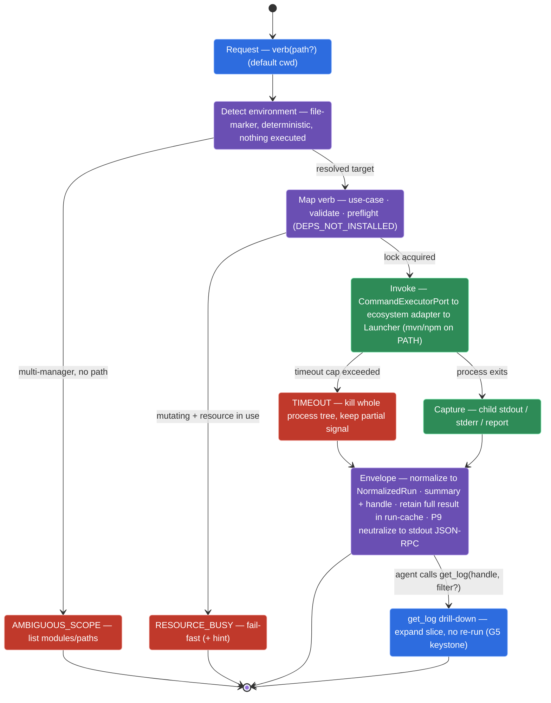
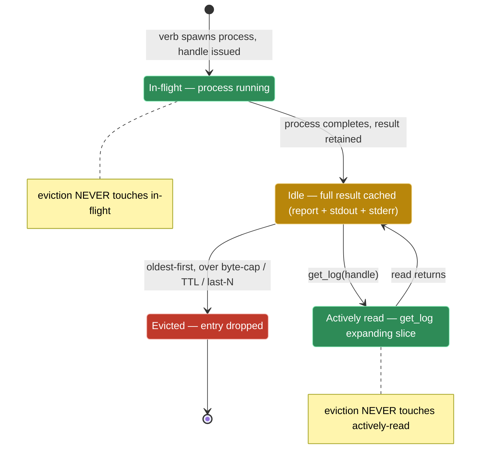

# Operational Model

## Install — global / stateless

The MCP is **not** bound to a single project. It can be installed **globally** and serve any repo.
Every verb accepts an optional `path` (default cwd); the MCP detects the manager **at that path**
and reads any non-sensitive project config from there.

## Scoping / ambiguity

Detection is **file-marker based** and deterministic (`pom.xml`, `build.gradle`,
`package.json` + lockfile, `Cargo.toml`, `go.mod`, `pyproject.toml`, …) — nothing is executed to
detect.

A fullstack repo carries **multiple managers at once** (e.g. Gradle backend + npm frontend). This
is the common case for the target audience, not a monorepo edge case (gotcha **G8**). Resolution is
**directory-scoped** via the `path` argument — no magic precedence:

```
run_tests(path="backend")    # Gradle
run_tests(path="frontend")   # npm/pnpm
```

When a verb is called ambiguously (multi-manager repo, no `path`), it returns the operational error
`AMBIGUOUS_SCOPE` listing the available modules/paths — discovery comes for free on the error path,
complementing `describe_project`.

## Timeout

Long verbs (`run_tests`, `build`) accept a `timeout`:

- **Default** per verb (sane).
- **Override** by the agent up to a **max cap** — the cap is a non-sensitive tuning knob, so the
  agent cannot set an infinite timeout.
- **On expiry**: kill the **whole process tree** (`destroyForcibly` + descendants) and return a
  structured `TIMEOUT` envelope with any partial signal. The MCP never hangs.

## Run cache (for `get_log`)

To deliver token-efficiency **without** signal loss, a verb returns a tight `summary` plus a
`handle`. The MCP **retains the full result** (report + stdout + stderr) indexed by that handle:

- Retention is **transient and session-scoped** (last-N runs / TTL).
- It is **not** durable config — it does not break the stateless-install property.
- `get_log(handle, filter?)` expands exactly the slice the agent asks for, with no re-run.
- **Defaults** (non-sensitive tuning knobs): keep the last ~10 runs, ~30 min, **or a total size
  cap (~N MB)** — whichever comes first. A single build log can be hundreds of MB; large logs are
  spilled to a temp file or truncated-with-pointer rather than held whole in memory (relevant given
  native-image-for-footprint).

The full run lifecycle — from the agent's verb call to the optional `get_log` drill-down — passes
through detection, verb mapping, the trusted Launcher, capture, and the common Envelope, with
`TIMEOUT` and `RESOURCE_BUSY` as fail-fast branches that never hang:



*The real run lifecycle: detection executes nothing, the Launcher is reached only through `CommandExecutorPort`, and `TIMEOUT`/`RESOURCE_BUSY`/`AMBIGUOUS_SCOPE` are fail-fast exits — the MCP never hangs, and the full result survives behind the `handle` for `get_log`.*

## Concurrency

Verb calls may run **in parallel** (e.g. `run_tests(path="backend")` and
`run_tests(path="frontend")` at once). Each call spawns its own process and gets its own `handle`;
calls are independent. The MCP applies a **bounded concurrency cap** to avoid resource exhaustion
from many heavy builds at once.

**Same-resource collisions.** Cross-target concurrency is fine; **same-resource mutation** is not.
By verb class:

- **Read verbs** (`git_*`, `pr_*`, `dependencies`, `describe_project`, `get_log`) — unrestricted
  concurrency; they mutate nothing.
- **Mutating verbs** (`build`, `run_tests`, `install`) — **mutual exclusion at the granularity of the
  resource they mutate**, enforced **fail-fast** with the operational error `RESOURCE_BUSY` (+ `hint`),
  **never** by hidden blocking (blocking interacts badly with the caller's `timeout` and hides
  duplicate work):
  - `build` / `run_tests` → per **resolved target** (the module owning the output dir).
  - `install` → per **manager** (lockfile and the shared local repo/cache — Maven `~/.m2`, npm cache —
    are global beyond a single `path`).
- **Run cache** — byte-cap eviction **never touches an in-flight or actively-read handle**; it evicts
  only completed, idle entries, oldest-first within the cap.



*Handle eviction only ever reclaims **completed, idle** entries oldest-first — an in-flight or actively-read handle is exempt, so a `get_log` drill-down can never race its own cache entry away.*

Fail-fast over queue/block keeps the operational-error model (P4) consistent and `timeout` clean —
see ADR-0005.

## Observability / logging

STDIO uses **stdout for the JSON-RPC channel**, so **no log may ever be written to stdout** — doing
so corrupts the protocol. Therefore:

- **All logs go to stderr**, with an **optional log file** (path via a non-sensitive config knob) for
  post-hoc debugging when the harness does not capture stderr.
- **Verbosity** is a non-sensitive, agent-tunable config knob.
- **Never log secrets or raw untrusted content** — forge tokens (see `forge-security-model.md`) and
  repo-derived content (P9) are excluded; the neutralize-and-cap discipline applies to logs too.
- **Spike-gated, not assumed:** confirm Micronaut MCP's default logger routes **off stdout** in the
  STDIO spike — an empirical check (gotcha **G15**), never reasoned to a conclusion.
