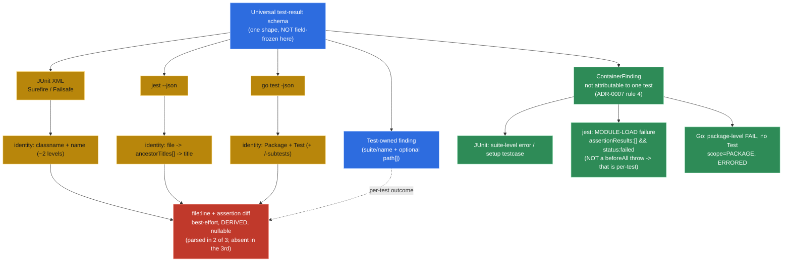
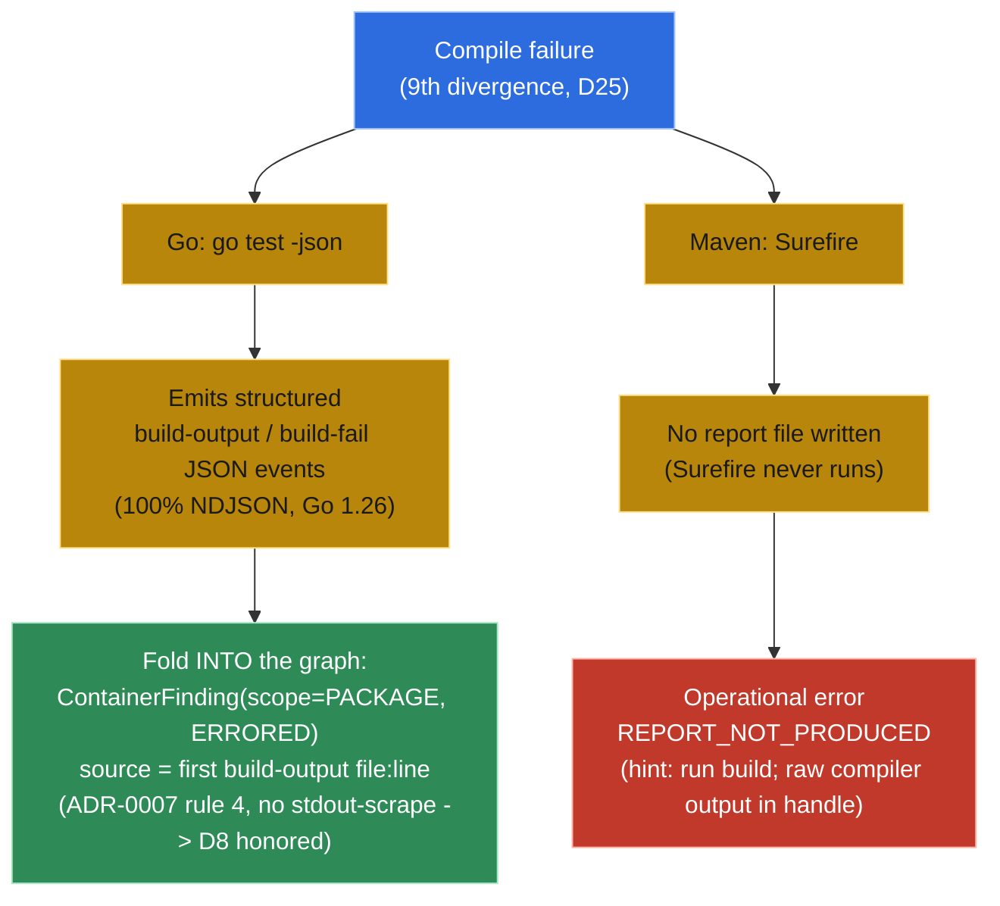

# Universal Test-Result Schema — Divergence Map

The project's riskiest technical bet is normalizing dissimilar test frameworks into **one** schema
(see `tool-catalog.md`). v1 spans three **dissimilar** report formats — JUnit XML
(Surefire/Failsafe), `jest --json`, and `go test -json` — to validate the schema from day one rather
than baking in JUnit assumptions.

This document is the **input to the universal-schema spike** (roadmap). It maps *where the three
formats refuse to share a shape*. It deliberately does **not** freeze field names — that is the
spike's job (parse one real report of each into one struct), recorded in an ADR **after** the spike.
Freezing fields on paper here would manufacture false precision — the very thing the spike exists to
settle.

## Divergence axes

| # | Axis | JUnit XML | `jest --json` | `go test -json` |
|---|---|---|---|---|
| 1 | Identity / hierarchy | `classname` + `name` (~2 levels) | file → `ancestorTitles[]` (arbitrary `describe` nesting) → `title` | `Package` + `Test` (+ `/`-joined subtests) |
| 2 | Outcome taxonomy | failure / error / skipped | passed / failed / pending / skipped / todo | pass / fail / skip (+ build-fail / panic implicit) |
| 3 | `file:line` | often **absent** — parse from `<failure>` stacktrace | **not a field** — parse from `failureMessages[]` stack | **not a field** — parse from `Output` lines |
| 4 | Message vs assertion diff | `message` attr + stacktrace body | `failureMessages[]` (message + diff + stack as one string) | interleaved in `Output` text |
| 5 | Failure with no single test owner | suite-level `<error>` / setup testcase | **collection/module-load failure** → `assertionResults: []` + file-level `message` (⚠ a `beforeAll` throw is attributed **per-test**, not no-owner — see note) | **package-level FAIL** with no `Test` (build failure, `TestMain`, `init` panic) |
| 6 | Captured output | `system-out` / `system-err` per suite/case | console per test (reporter-dependent) | `Output` events interleaved |
| 7 | Parametrized identity | `name[0]`, display names | `test.each` interpolated titles | subtests `Test/case` |
| 8 | Retry / flaky *(lower-confidence; confirm in spike)* | Surefire `flakyFailure` / `rerunFailure` | `jest.retryTimes` re-runs | `-count` / tooling re-runs; no native retry marker |

> **Axis-5 correction (empirical, jest 29.7.0).** The `/prototype` pass parsed a real `jest --json`
> report and found that a `beforeAll` throw does **not** make assertions vanish — jest attributes the
> hook failure to **each test** in the suite (they appear as failed `assertionResults`). jest's genuine
> no-test-owner case is a **collection/module-load failure** (e.g. a top-level throw), which yields an
> empty `assertionResults` plus a file-level `message`. The original "assertions vanish on `beforeAll`"
> wording was disproved against the real report. The universal schema handles both shapes (per-test →
> a test finding; collection failure → a no-owner finding). Evidence: the throwaway prototype's NOTES.

## Safe to assert now (without freezing field names)

1. **Identity is a flexible path** (`suite`/`name` + optional `path[]`), never a fixed `classname`
   (axes 1, 7).
2. **`file:line` and assertion diff are best-effort, derived, nullable** — never guaranteed fields
   (axes 3, 4). The false-precision trap: `file:line` is parsed, not a field, in two of three formats
   and sometimes absent in the third.
3. The schema needs a **first-class failure not attributable to a single test** — suite / file /
   package-level (axis 5, a structural divergence).
4. **Outcome = a normalized enum + the raw status retained** (axis 2).
5. **Expected-vs-actual cannot be reliably structured** across all three → keep a `message` + a
   best-effort diff (axis 4).

*Divergence map: one universal schema absorbs three dissimilar formats — identity is a flexible path, `file:line`/diff stay derived & nullable (red), and failures with no single test owner fold into a `ContainerFinding` (green) — where jest's no-owner trigger is a module-load failure with empty `assertionResults`, never a `beforeAll` throw (which is attributed per-test).*

## Resolved by the spike → [ADR-0007](../adr/0007-normalized-test-result-schema.md) (accepted)

The universal-schema spike (`spikes/s1-schema/`) froze the open items here:

- **Exact field names and the concrete struct** — frozen in ADR-0007 (the §2 record graph).
- **Retry/flaky (axis 8)** — **deferred** from v1 (ratified; no captured report carries a retry marker).
- **The recorded schema** — ADR-0007 is the freeze of record (after the spike, per documentation-first).
- **Axis-5 jest correction** (above) and the **Go build-output/build-fail** handling (compile errors are
  JSON-wrapped, keyed by `ImportPath`) were both empirically settled by the spike.

## Report-absence asymmetry (compile failure)

A **9th divergence**, surfaced while scoping PRD-1 (decision-log **D25**): a compile failure produces
*different shapes per ecosystem because the report formats differ*, not because the schema is
inconsistent.

| Ecosystem | On compile failure | Result |
|---|---|---|
| Go (`go test -json`) | Emits structured `build-output`/`build-fail` JSON events | Folded **into** the graph as `ContainerFinding(ERRORED)` (ADR-0007 rule 4) |
| Maven (Surefire) | **No** report file is written (Surefire never runs) | Operational error **`REPORT_NOT_PRODUCED`** (+ hint "run `build`"); raw compiler output in the `handle` |

*Report-absence asymmetry: when a report exists (Go wraps the build failure in NDJSON) it folds into a `ContainerFinding(ERRORED)`; when none is written (Surefire never runs) there is nothing to fold, so the server returns the operational error `REPORT_NOT_PRODUCED` instead of stdout-scraping the compiler.*

The universal schema normalizes **reports**; when a report is absent there is nothing to fold, and
folding it anyway would require stdout-scraping the compiler output (rejected by D8). The `build` verb
(later PRD) owns compile-error → `file:line` parsing. This refines, and does not contradict, ADR-0007
rule 2 (the ERRORED discriminator governs a finding *when one exists*).

### Go compile-fail — empirically de-risked (2026-06-05, Go 1.26, PRD-3 grill)

The prototype (`prototype/NOTES.md`) left one Go open item: *"a Go build failure interleaves non-JSON
output on stdout — the fixture used a runtime `init()` panic, clean JSON; the compile-error path is
un-de-risked."* Settled empirically by running `go test -json` against two non-compiling packages
(broken source, broken test file), capturing `stdout`+`stderr` merged:

- **Output is 100% valid NDJSON — zero interleaved raw text** (even with `2>&1`). The "non-JSON
  interleaving" worry **does not reproduce on Go 1.26**; `go test -json` wraps the whole build failure
  into the JSON event stream.
- Event sequence per failed package:
  `build-output`(header) → `build-output`(the compiler diagnostic) → `build-fail` → package `start`
  → package `output` (`FAIL\t<pkg> [build failed]`) → package `fail` (`Elapsed:0`, `FailedBuild:<importpath>`).
- **`build-output.Output` carries `file:line:col: message`** (e.g. `brokensrc/brokensrc.go:5:9: cannot
  use "not an int" … as int value …`) → `SourceRef{file,line}` is derivable (col dropped — `SourceRef`
  has no column; that detail belongs to the `build` verb's `CompileDiagnostic`, not this fold).
- The events carry **`ImportPath`** with a `[pkg.test]` suffix (`nbm/gofail/brokensrc [nbm/gofail/brokensrc.test]`);
  the `start`/`fail` events carry the clean **`Package`**. The normalizer keys build-output → package
  by stripping ` [...]`, and the package `fail` carries **`FailedBuild`** to bind them.
- **Process exit = 1** (consistent with the D28 exit-code floor).

**Normalizer rule (Go compile-fail):** collect `build-output` per import path; on `build-fail` + package
`fail`, emit `ContainerFinding(scope=PACKAGE, outcome=ERRORED, container=<Package>, message=<joined
build-output>, source=<first file:line>)` — exactly ADR-0007 rule 4. No stdout-scraping (the diagnostics
are JSON-wrapped), so D8 is honored. Fixtures captured under `/tmp/nbm-gofail/` during the grill; lift
clean copies into `src/test/resources/fixtures/go/` as the PRD-3 red fixtures.

### jest reporter & no-owner shape — empirically grounded (2026-06-05, jest 30.4.1, PRD-3 grill)

Ran a real jest suite (1 pass, 1 assertion-fail, 1 top-level-throw module-load failure) to ground the
Node `run_tests` invocation + the axis-5 no-owner shape against the **current** jest, not the prototype's
29.7:

- **Reporter injection = `jest --json --outputFile=<fresh> --testLocationInResults`** — MCP-controlled
  flags, the Node analog of Surefire's injected `-Dsurefire.reportsDirectory` (D4 injected-not-free-flag;
  D27 freshness). With `--outputFile`, the JSON report goes to the **file** and **stdout stays empty**
  (jest's human reporter is on stderr) → the STDIO JSON-RPC channel is **never polluted** (G15), and the
  fresh per-run `--outputFile` path **is** the D27 freshness gate (any content is necessarily this run's).
- **Exit code = 1** on test failure **and** on no-tests-match ("0 matches") → the D28 exit-floor and the
  D29 `NO_TESTS_RUN` map cleanly; the JSON also carries `success:false` + `numTotalTests` /
  `numPassedTests` / `numFailedTests` + `numRuntimeErrorTestSuites`.
- **No-test-owner (axis 5) discriminator = `assertionResults:[] && status:"failed"`** (corroborated by
  top-level `numRuntimeErrorTestSuites`). ⚠ In jest 30 **`testExecError` is `null`** for a top-level
  throw — do **not** key on it. The empty-`assertionResults` + file-level **`message`** (`● Test suite
  failed to run … > 2 | throw …`) is the reliable signal → `ContainerFinding(FILE, ERRORED)`, message
  from `testResults[].message`. Confirms (and sharpens) the prototype's axis-5 correction on jest 30.
- **`file:line`** for a normal failure: structured **`assertionResults[].location = {line,column}`** (the
  test-declaration site) when `--testLocationInResults` is injected — a machine field (D8-aligned, no
  stack-scrape); the exact failure site stays in `failureMessages[0]` stack (`fail.test.js:3:21`) as
  best-effort `detail`.
- **Security / preflight posture:** invoke jest via the trusted `npm`/`npx` launcher on PATH with
  **`--no-install`** (or resolve `node_modules/.bin/jest` directly) so the runner **never
  network-fetches** a framework — a missing jest → preflight `DEPS_NOT_INSTALLED` (D21), never an
  implicit download (consistent with D38's anti-network-fetch stance). Drive the framework **directly**
  with injected reporter flags, **not** through the project's `npm test` script (which may not be jest,
  or may swallow `--json`). Fixtures under `/tmp/nbm-jest/`; lift clean copies into
  `src/test/resources/fixtures/jest/`.
