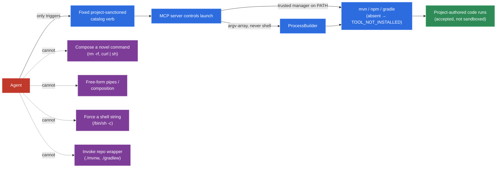
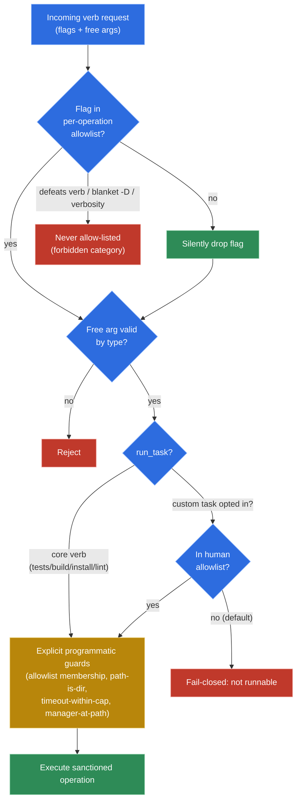

# Security Model

See pillars P1–P3, P8, P9 in [`README.md`](./README.md).

## Guarantee

> **"The agent cannot compose a *novel* command; it can only trigger operations from a fixed,
> project-sanctioned catalog."**

This is **not** "zero dangerous code runs" — that would require a real sandbox. Running
`npm test` / `mvn test` / `install` executes project-authored code (test scripts, postinstall
hooks); that is accepted as unavoidable. What the guarantee kills: `rm -rf`, invented `curl | sh`,
exfiltration, and any other command the *agent* composes on its own.

## Execution mechanism

| Aspect | Decision |
|---|---|
| Process launch | argv-array via `ProcessBuilder`. **Never** a shell string, **never** `/bin/sh -c`. |
| Launcher resolution | The **trusted system manager** on `PATH` (`mvn`, `npm`, …), **never** a repo-authored wrapper (`./mvnw`, `./gradlew`). A wrapper is an agent-rewritable script (P8 → repo write access), so invoking it would make an ecosystem verb an agent-composed arbitrary-command vector. Absent manager → `TOOL_NOT_INSTALLED`. See **ADR-0008**. |
| Composition / pipes | Not supported as free-form. Native pipes do not exist; only explicit, sanctioned operations. |
| Windows shims | Package-manager launchers (`npm`, `mvn`, `gradle`, `pnpm`) are `.cmd`/`.bat`; the MCP resolves the concrete executable and validates args strictly. The invariant is *no agent-controlled shell string*, not *no OS process facility*. See gotcha **G13**. |
| Why | Shell-string parsing/sanitization (escaping, metacharacters, aliases) is a known minefield and would break the guarantee. See gotcha **G1**. |

*Trust boundary: the agent may only trigger a catalog verb; the server — not the agent — owns process launch via an argv-array `ProcessBuilder` against the trusted PATH manager (ADR-0008, G1).*

## Flag / argument policy

- **Allowlist of flags per operation.** Each operation declares the flags it permits.
- **Unknown flags are silently dropped** (per the original requirement) — they never reach the
  process.
- **Free args** (paths, test names) are validated by **type**, not by a shell.

**Allowlist principle (what an operation's seed admits).** Three categories are *never* allow-listed,
regardless of operation: (1) flags that **defeat the verb** (e.g. `-DskipTests` / `-Dmaven.test.skip`
on `run_tests` — they would false-green a clean run); (2) **arbitrary `-D` system properties** (e.g.
`-Dmaven.repo.local=…`) — only specific, individually-vetted property keys are admitted, never a blanket
`-D`; (3) flags whose only effect is **stdout verbosity** (`-X`, `-q`) — output is parsed from the
report file, so they add noise without value. Test **selection** flags (`-Dtest=`, `-pl`) are *not*
agent free-flags either: the structured target selector translates intent into `-Dtest=` and the MCP
**injects** the controlled value.

> **`run_tests`/Maven seed allowlist (PRD-1):** `-o`/`--offline`, `--fail-at-end`/`-fae` only. The seed
> grows per concrete requirement; the categories above stay forbidden.

## Task execution governance (`run_task`)

`run_task` is the escape hatch for project-defined scripts — and the one place where
**composition-safe ≠ consequence-safe** (gotcha **G14**). The formal guarantee (no *novel* command)
is about composition; the project's goal is about *consequence* (no autonomous damage). A
project-defined `deploy:prod` / `db:migrate:prod` / `release` is composition-safe but catastrophic
to auto-run.

**Decision — opt-in allowlist, fail-closed:**

- By default **no** custom task is runnable via `run_task`.
- The **human** opts specific tasks in, in the non-agent-mutable project config.
- The 4 core verbs (`run_tests`, `build`, `install`, `lint`) stay always-available (they *are* the
  sanctioned operations).
- The bootstrap skill can scaffold the allow-list by listing detected tasks for the human to pick.

*Guardrail decision flow: flag allowlist → type-validated free args → `run_task` fail-closed opt-in → explicit programmatic guards; the forbidden flag categories and fail-closed branch can never reach execution (G4, G14).*

## Policy governance

| Aspect | Decision |
|---|---|
| Defaults | Curated, **compiled into** the binary, versioned with it. |
| Project config | Human-authored; the MCP only **reads** it (never writes). |
| Scope of config | Only **non-sensitive** knobs: caps, verbosity, manager disambiguation, which verbs to expose. |
| Hard limit | Config can **never** introduce a new command or flag. The guarantee therefore survives even if the agent has write access to the repo (and thus the config file). |

## Input validation (layered)

1. **JSpecify** — nullness contracts only (`@NullMarked`, `@Nullable`). Static analysis; **not**
   value validation.
2. **Jakarta Bean Validation** — Micronaut-native, build-time, reflection-free. Format constraints
   on args (`@NotBlank`, `@Pattern`, `@Max`). Works in native image.
3. **Explicit programmatic guards** — the **security** rules that annotations cannot express:
   allowlist membership, path-is-a-directory, timeout-within-cap, manager-detected-at-path.

> The security boundary is **explicit, centralized, fail-closed code** — never an annotation.
> Annotations are ergonomics and defense-in-depth. See gotcha **G4**.

## Outbound content — prompt-injection defense

The MCP returns repo-derived content (test names, assertion messages, paths, dependency names, lint
messages, `stderr`) into the agent's context — a **confused-deputy** surface. A malicious/compromised
repo could craft that content to carry an injection.

**Decision:** treat all repo-derived content as untrusted **data**, never instructions:

- Strip control chars / ANSI / zero-width sequences.
- Per-field caps.
- Explicitly mark `untrusted` content in the envelope.
- Lean on the already-**structured** output (typed fields) so content lands as data.
- **Do not** attempt fragile heuristic injection-detection (false positives/negatives would redact
  real error signal).
