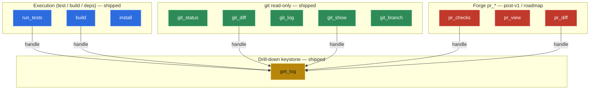

# Tool Catalog (v1)

Manager-agnostic logical verbs (pillar P5). **One** MCP server (not one-per-manager). Every verb
accepts an optional `path` (default cwd) so the MCP works when **installed globally**.

**v1 ecosystems:** Maven (JVM) + Node (npm, pnpm, yarn) + Go. git is ecosystem-agnostic. **Gradle is
deferred post-v1** — it shares Maven's JUnit-XML report format (low de-risk) and had ≈0 local
evidence. See gotcha **G11**.

## Tools

| Tool | Purpose | Notes |
|---|---|---|
| `describe_project(path?)` | Orientation in one call: detected modules, manager per module, available verbs, **valid flags, and custom tasks/scripts**. | Custom tasks (`pnpm sandcastle:*`, `moon run <proj>:test`, Makefile targets, Gradle tasks) are **first-class** — evidence shows these are the top producers, not the standard verbs. |
| `run_tests(path?, target?, flags?, timeout?)` | Run tests; return normalized failures. | **Structured target selector** (class / file / method / module) → translated to `-Dtest=`, `--tests`, jest pattern, `-k`. Avoids full-suite re-runs (waste pattern P6). |
| `build(path?, flags?, timeout?)` | Build / compile. | Compile errors → `diagnostics[]` of `CompileDiagnostic{file, line, col, severity, message}`, parsed from the manager's structured compiler output (Maven `[ERROR] <file>:[<line>,<col>]`); full output via `handle`. A **build-specific** shape — **not** the test `failures[]`/`Finding` schema (a compile error has no test identity / `Outcome` / column). See [ADR-0009](../adr/0009-build-compile-diagnostic-output.md). Else truncated-with-cap. |
| `install(path?, flags?)` | Install dependencies. | Project-sanctioned; runs lifecycle hooks (accepted by the guarantee). |
| `lint(path?, flags?)` | Lint. | Structured findings (eslint `--format json`, checkstyle XML) when available. |
| `run_task(name, path?)` | Run a **project-defined** task the user has **opted in**. | **Opt-in allowlist, fail-closed**: by default *no* custom task is runnable; the human allow-lists tasks in the non-agent-mutable project config. "Project-defined ≠ safe to auto-run" — real repos hold `deploy:prod`, `db:migrate:prod`, `release` (gotcha **G14**). The 4 core verbs stay always-available. **No** arbitrary extra args (gotcha **G10**). |
| `dependencies(path?, mode)` | Query-oriented dependency info. | Modes: `direct`, `why <pkg>`, `resolve <pkg>`. Normalized single schema. **Never** dumps the full transitive tree. |
| `get_log(handle, filter?)` | Drill-down into a retained run result. | Expands exactly the requested slice (one failure, a test's system-out, full stderr) **without re-running**. The anti-RTK keystone (gotcha **G5**). |
| `git_status` / `git_diff` / `git_log` / `git_show` / `git_branch` (read-only) | Structured git inspection. | **Read-only only.** Ecosystem-agnostic (one cheap adapter). Highest-volume evidence category (773 calls). **Per-verb normalized shapes parsed from `--porcelain=v2` / `--format=`** (git's machine contract, locale-stable — the D8 "parse the machine format, never scrape stdout" rule applied to git); `git_log` returns a capped commit list with full body via `git_show`; large `git_diff`/`git_show` patches sit behind a `handle` + `get_log`. `manager` is null for git. Mutating git is post-v1. **Five discrete verbs, not a `git(mode)` tool** — see ADR-0001. See decision-log D34. |

### Verb taxonomy

The catalog groups by category: a **test/build/dep** execution group, the ecosystem-agnostic
**git read-only** group (five discrete verbs, not `git(mode)` — ADR-0001), the **drill-down**
keystone `get_log`, and the **post-v1 forge** group. Core verbs are shipped; forge `pr_*` is
deferred to a later PRD (D46).

*Verb catalog by category: blue execution verbs, green git read-only verbs, and red post-v1 forge verbs all funnel large results through the amber `get_log` drill-down keystone (G5).*

## Forge inspection (post-v1 — a later PRD)

Remote, read-only inspection of a code-hosting forge over **HTTP** (ADR-0002, ADR-0003). **Deferred
to a later PRD** (decision-log **D46**: read-only `pr_*` does not remove `gh` from the dev loop, so it
does not advance the v1 remove-Bash-on-self thesis — it earns its own PRD; distribution is **PRD-4**).
The first forge target is **GitHub** (`github.com` + GitHub Enterprise Server); GitLab (SaaS +
self-hosted) follows. Native REST/GraphQL, normalized into the same envelope. **No** generic `api`
passthrough. Governed by a separate security domain — see [`forge-security-model.md`](./forge-security-model.md).

| Tool | Purpose | Notes |
|---|---|---|
| `pr_checks(path?, ref?)` | CI check status for a PR / branch / commit. | Per-check `name` + `conclusion` (pass/fail/pending) + a `handle`. The failing check's log is drilled into via `get_log(handle)` — the `gh run view --log-failed` pattern, **non-lossy, no separate log verb**. The entry point of the CI-gated loop. |
| `pr_view(path?, pr?)` | PR metadata in one call. | State, mergeable, review status, head/base, checks summary. |
| `pr_diff(path?, pr?)` | The PR's diff. | Reuses `handle` + `get_log` for large diffs (same as `git_diff`). |

- **Canonical verb prefix `pr_`** — "pull request (GitHub) / merge request (GitLab)". Forge-neutral
  logical verbs (P5); each tool's description disambiguates per forge.
- **`pr_list` is deferred** (low local evidence; YAGNI until it appears).
- Forge verbs **return a `handle`**, so `get_log` is the universal drill-down for CI logs and diffs.
- Instance (base URL) + read-scoped token are **per-instance, human-authored, non-agent-mutable**
  config — never agent input. See `forge-security-model.md`.

## Output contract

- **Common envelope** for every verb: `{ ok, verb, manager, summary, handle?, ... }`.
- **Success** → minimal payload (counts only; the report is not even read).
- **Failure (test)** → normalized `failures[]` (class, test, message, `file:line`, project-side
  stack frames), with caps that truncate noise but never signal (pillar P4).
- **Failure (build/compile)** → `diagnostics[]` of `CompileDiagnostic{file, line, col, severity,
  message}` — a build-specific shape distinct from test `failures[]` ([ADR-0009](../adr/0009-build-compile-diagnostic-output.md));
  full compiler output via `handle`.
- **Failure (operational)** → enumerated `code` (`NO_MANAGER_DETECTED`, `TOOL_NOT_INSTALLED`,
  `DEPS_NOT_INSTALLED`, `UNSUPPORTED_TEST_FRAMEWORK`, `INSTALL_FAILED`, `REPORT_NOT_PRODUCED`,
  `TIMEOUT`, `INVALID_PATH`, `AMBIGUOUS_SCOPE`, `RESOURCE_BUSY`, …) +
  message + actionable `hint`. Distinct from test failures so the agent branches deterministically.
- **Preflight** → before `run_tests`/`build`, if dependencies are missing or out of sync with the
  lockfile, return `DEPS_NOT_INSTALLED` (hint: "run `install`") instead of letting the agent hit a
  cryptic module-not-found stack trace and waste a round-trip diagnosing it.

## Result source

Parse machine-readable **report files** (Surefire/Failsafe XML, JUnit XML, `jest --json`,
`go test -json`, …) — **not** stdout scraping (fragile to version/locale/color/flags). The MCP
**injects the reporter flag** and **knows where the report is written**, then normalizes into the
single schema.

> Normalizing dissimilar frameworks into one schema is the project's riskiest technical bet — which
> is why v1 deliberately spans **three dissimilar report formats** (JUnit XML, `jest --json`,
> `go test -json`) to validate the universal schema from day one rather than baking in JUnit
> assumptions. See [`schema-divergence-map.md`](./schema-divergence-map.md) for the divergence axes.

> **Reporter injection is per test *framework*, not per manager** (gotcha **G12**). The JVM side is
> easy — Surefire/Failsafe emit standardized JUnit XML regardless of JUnit4/5/TestNG. The Node side
> is not — jest / vitest / mocha each need a different reporter flag and emit different JSON, so the
> adapter must detect the framework from `package.json`. Go's `go test -json` is uniform.
