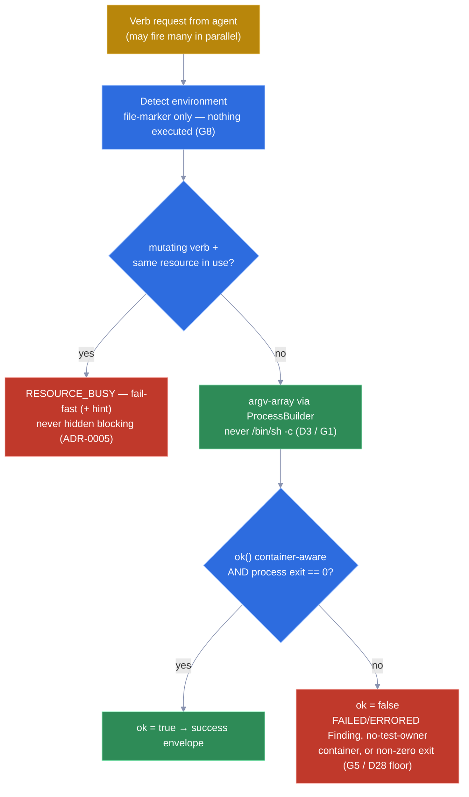
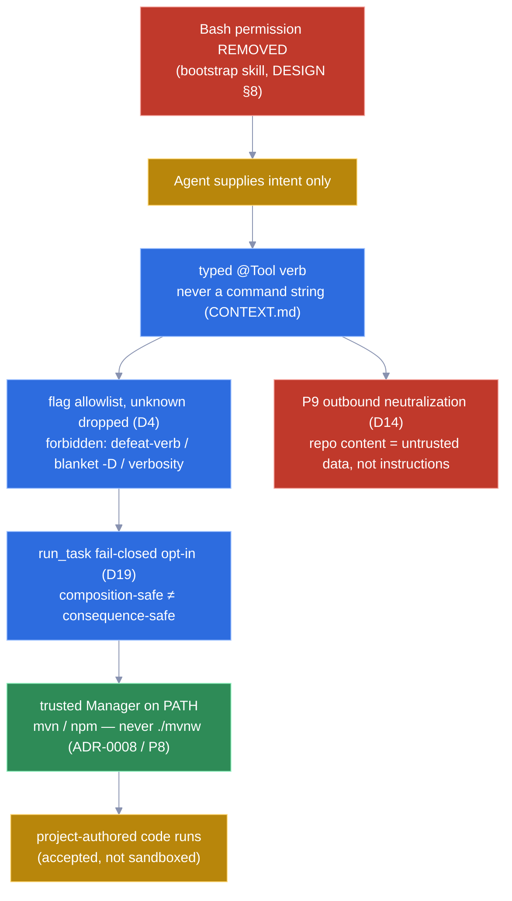
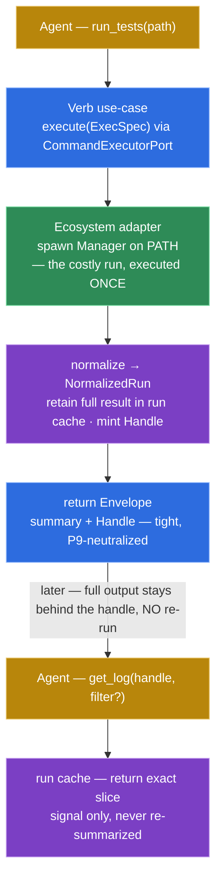
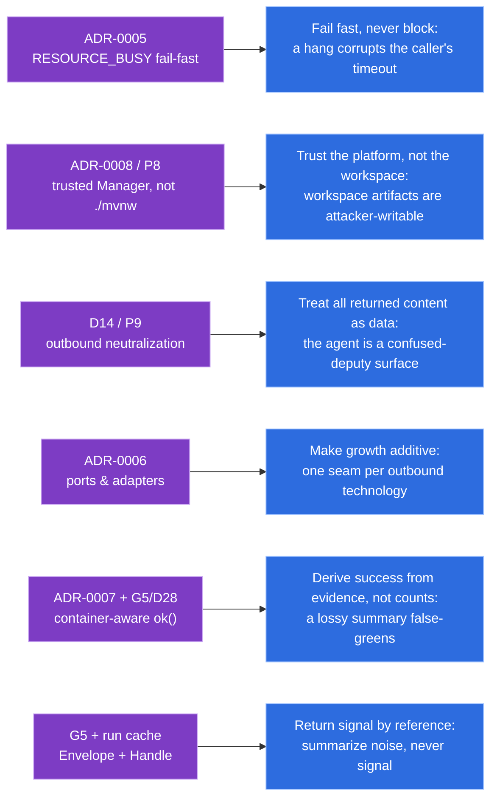

# Lesson — Architecture of a resilient, secure, scalable agentic backend

> A worked example, not an essay. Every claim below is taken from **this** project — `no-bash-mcp`,
> a Micronaut MCP server that replaces an agent's Bash tool with safe, structured, token-efficient
> verbs so the Bash permission can be removed. The architecture is in [`DESIGN.md`](../../DESIGN.md);
> the language in [`CONTEXT.md`](../../CONTEXT.md); the rationale in
> [`docs/design/`](../design/) and [`docs/adr/`](../adr/). This lesson reads those decisions back as
> teachable principles.

An **agentic backend** is a system an autonomous LLM drives directly. The agent is not a trusted
caller: it can hallucinate a command, be prompt-injected by repo content, fire calls in parallel, and
mistake a malformed result for a passing one. The three properties below — resilience, security,
scalability/operability — are not generic virtues here. Each is the answer to a specific way an agent
breaks a backend, and each is decided in a specific ADR or decision-log entry of this repo.

A consistent color key runs through every diagram: **gold** = external (agent, manager, forge),
**green** = adapter / safe outcome, **blue** = server application layer, **purple** = pure domain core,
**red** = a fail-fast / forbidden path.

---

## 1. Resilience — making whole classes of failure unrepresentable

Resilience here is not retry logic. It is *reducing the number of ways a run can go wrong* by removing
the mechanisms that produce wrong results. Four decisions do almost all the work, and each one closes a
failure mode at the source rather than handling it after the fact.

- **Concurrency guard → `RESOURCE_BUSY`** ([ADR-0005](../adr/0005-concurrent-mutation-fails-fast.md)).
  Agents fire verbs in parallel. Two `build`s on the same resolved target would corrupt each other's
  output dir. The MCP **fails fast** with the operational error `RESOURCE_BUSY` (+ `hint`) on a
  same-resource collision — **never** hidden blocking, because blocking interacts badly with the
  caller's `timeout` and hides duplicate work. Read verbs (`git_*`, `dependencies`, `get_log`) stay
  unrestricted.
- **Exit-code floor / container-aware `ok()`** (DESIGN §2 counting rule, gotchas G5 / D28). A lossy
  summary is the project's defining failure mode. `ok` is derived from **findings**, not from counts:
  `ok = no Finding is FAILED or ERRORED` **and** a non-zero process exit is itself a failure signal. A
  run whose *only* failure is a no-test-owner `ContainerFinding` (a `@BeforeAll` throw, a jest
  module-load failure, a Go `init()` panic) passes every test by count yet must report **red** — and
  does.
- **Environment detection is inert** (operational-model "Scoping", gotcha G8). Detection is
  **file-marker based** (`pom.xml`, `package.json` + lockfile, `go.mod`) — **nothing is executed to
  detect**. You cannot get a side effect, a hang, or an injection out of a detector that only reads
  marker files.
- **No-shell invocation** ([ADR-0008](../adr/0008-trusted-manager-launcher-not-repo-wrapper.md), D3 /
  G1). Process launch is an **argv-array via `ProcessBuilder`**, never `/bin/sh -c`. Shell-string
  parsing (escaping, metacharacters, aliases) is a minefield; deleting the shell deletes the whole
  category of escaping bugs.

*Four failure-mode reductions on one path: inert file-marker detection, the `RESOURCE_BUSY` concurrency guard, the no-shell `ProcessBuilder` argv, and the anti-false-green exit-code floor — so a parallel-firing agent cannot corrupt a build, escape via a shell, or read green from a lossy summary.*

The lesson: **resilience is mostly subtraction.** Each decision removes a capability (a shell, a
blocking wait, an executed detector, a count-only `ok`) and with it an entire failure class. You do not
harden what is not there.

---

## 2. Security — the agent owns intent, never the command line

The guarantee this project actually makes is precise and load-bearing:

> *"The agent cannot compose a **novel** command; it can only trigger operations from a fixed,
> project-sanctioned catalog."*

This is **not** a sandbox and does not claim "zero dangerous code runs" — `mvn test` still runs
project-authored test code. What it kills is the *agent-composed* `rm -rf`, the invented `curl | sh`,
the exfiltration. The whole architecture exists to keep the **command line out of the agent's hands**,
end to end:

- **Remove the Bash permission entirely.** The bootstrap skill suggests dropping Bash and writes a
  transitional declarative git deny-list (DESIGN §8). No Bash tool means no agent-composed command
  surface at all — the verbs are the only door.
- **Typed verb, not a command.** The agent invokes intent (`run_tests`, `build`) through a Micronaut
  `@Tool` bean; it never supplies a command string. "Command" is a banned word in `CONTEXT.md` for
  exactly this reason.
- **Controlled invocation + flag allowlist** (D4). Each operation allow-lists its flags; unknown flags
  are **silently dropped**; three categories are *never* admitted — flags that defeat the verb
  (`-DskipTests`), blanket `-D` properties, and pure verbosity (`-X`/`-q`).
- **Guardrail, fail-closed.** `run_task` runs only human-opted-in project tasks (D19) — by default
  **no** task is runnable, because composition-safe ≠ consequence-safe (a project-defined `deploy:prod`
  is composition-safe yet catastrophic). The security boundary is **explicit, centralized, fail-closed
  code**, never an annotation (gotcha G4).
- **P9 outbound neutralization** (D14). Repo-derived content (test names, messages, stderr) is a
  confused-deputy / prompt-injection surface. It is returned as **data, never instructions** — control
  chars / ANSI stripped, per-field caps, explicitly marked `untrusted`.
- **Trusted Launcher, never `./mvnw`** ([ADR-0008](../adr/0008-trusted-manager-launcher-not-repo-wrapper.md),
  P8). The server spawns the **trusted system manager on `PATH`** (`mvn`, `npm`), never a repo-authored
  wrapper. A wrapper is an agent-rewritable script (the agent has repo write under P8), so invoking it
  would turn an ecosystem verb back into an arbitrary-command vector.

*The command line never enters the agent's hands: with Bash removed, intent flows through a typed verb, a flag allowlist, and a fail-closed `run_task` gate to the trusted PATH Manager (never an agent-rewritable `./mvnw`) — while every byte returned is P9-neutralized as untrusted data.*

The lesson: **a guarantee is only as strong as its weakest re-entry point.** Removing Bash is
meaningless if `./mvnw` re-opens the door, or if returned repo text can re-program the agent. Security
is each link being closed *and* the chain having no bypass.

---

## 3. Scalability & operability — boring structure, token-cheap output

Scalability here is not throughput; it is **the cost of adding the next ecosystem and operating the
result**. Two structural choices and one output choice carry it.

- **Hexagonal ports-and-adapters** ([ADR-0006](../adr/0006-application-architecture.md)). The deciding
  variable was **adapter count, not project size**: two outbound technologies (process execution, forge
  HTTP) each need an independent test seam. The pure domain exposes exactly two driven ports —
  `CommandExecutorPort` and `ForgePort` — and the `@Tool` bean *is* the inbound adapter (no inbound
  port; transport is config). An ArchUnit test enforces `domain !-> adapter`.
- **Ecosystem dispatch = one use-case + a strategy adapter.** `CommandExecutorPort.execute(ExecSpec)`
  exposes only `{exitCode, stdout, stderr, timedOut}` — it knows **nothing** about tests or formats.
  All format knowledge lives in the per-ecosystem normalizer (Maven reads a Surefire **file**; Go
  parses `go test -json` from **stdout**). Adding Rust or Python is a new `adapter/out/ecosystem/*`
  normalizer behind the *same* port and use-case — not a new verb path.
- **Envelope + handle drill-down** (operational-model, gotcha G5). Every verb returns a tight common
  `Envelope` (counts + per-failure `message`/`SourceRef`) plus an opaque **`Handle`**. The full result
  (report + stdout + stderr) is retained **session-scoped** in the run cache; `get_log(handle, filter?)`
  expands exactly the requested slice **without re-running**. Token efficiency comes from **removing
  noise, never from summarizing signal** — the keystone of non-lossy output.

A sequence view makes the token economics legible: the expensive run happens once, the summary is
small, and the full detail is fetched on demand by reference.

*The token-efficiency round-trip: the costly run executes once behind `CommandExecutorPort`, the agent gets a small summary + `Handle`, and `get_log` later expands only the requested slice from the run cache — never a second run, never lossy summarization of signal.*

The lesson: **operability is decided by the seams.** One port + one strategy adapter per ecosystem
makes growth additive; one envelope + one handle makes output uniform and cheap. The structure is
deliberately boring — KISS at ~15 verbs, a single Maven module — so the *next* contributor reasons about
one shape, not many.

---

## 4. Why this generalizes — staying grounded in the decisions

None of the above is `no-bash-mcp`-specific accident. Each decision yields a rule that holds for any
backend an autonomous agent drives. The map below traces every generalizable rule back to the concrete
artifact it came from in this repo — so the generalization is read off real decisions, not asserted.

*Every generalizable rule (right) is the read-off of a specific decision in this repo (left): the principles are grounded in ADRs and decision-log entries, not retrofitted best-practice.*

Read together, the three properties share one spine: **the agent is an untrusted, fallible, parallel
caller, so move every consequential choice out of its hands and into typed, fail-closed, evidence-driven
code.** Resilience subtracts the mechanisms that fail. Security keeps the command line server-owned end
to end. Scalability makes the seams boring and the output cheap. That is the architecture of a resilient,
secure, scalable agentic backend — as actually decided, line by line, in `no-bash-mcp`.

---

## References

- Architecture: [`DESIGN.md`](../../DESIGN.md) (§1 hexagonal, §2 schema/floor, §4 dispatch, §5 ports, §6 envelope, §8 Launcher).
- Language: [`CONTEXT.md`](../../CONTEXT.md) (Verb, Guardrail, Envelope, Handle, Launcher).
- Decisions: [`docs/design/security-model.md`](../design/security-model.md),
  [`docs/design/operational-model.md`](../design/operational-model.md), and the decision-log.
- ADRs: [0005](../adr/0005-concurrent-mutation-fails-fast.md),
  [0006](../adr/0006-application-architecture.md),
  [0007](../adr/0007-normalized-test-result-schema.md),
  [0008](../adr/0008-trusted-manager-launcher-not-repo-wrapper.md).
